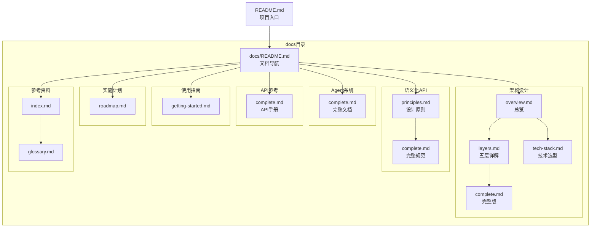

# Quest文档索引

完整的文档清单和内容说明。

---

## 📋 根目录文件

| 文件 | 大小 | 说明 |
|------|------|------|
| [README.md](README.md) | 12.3KB | ⭐ 项目总览、特性介绍、快速开始 |
| [LICENSE](LICENSE) | 1.1KB | MIT开源许可证 |
| [CONTRIBUTING.md](CONTRIBUTING.md) | 1.5KB | 贡献指南、如何参与 |
| [PROJECT_STATUS.md](PROJECT_STATUS.md) | 5.2KB | 项目状态、当前进度 |
| [SUMMARY.md](SUMMARY.md) | 12.4KB | 项目总结、核心成就 |
| [SETUP.md](SETUP.md) | 4.1KB | 设置指南、Git Submodule说明 |
| [COMPLETION_REPORT.md](COMPLETION_REPORT.md) | ~10KB | 完成报告、交付清单 |
| [DOCUMENTATION_INDEX.md](DOCUMENTATION_INDEX.md) | 8.3KB | 文档索引（本文件） |
| .gitignore | 0.6KB | Git忽略规则 |
| .gitmodules | 0.1KB | Git Submodule配置 |

### 特殊目录

| 目录 | 说明 |
|------|------|
| [engine/](engine/) | 🎮 Cocos 4引擎（Git Submodule，~200MB） |
| [docs/](docs/) | 📚 完整文档（270KB，19篇） |

---

## 📚 docs/ 目录结构

### 01-architecture/ - 架构设计（4篇）

| 文件 | 大小 | 说明 | 推荐阅读顺序 |
|------|------|------|-------------|
| [overview.md](docs/01-architecture/overview.md) | 6KB | 架构总览（精简） | ⭐ 1 |
| [layers.md](docs/01-architecture/layers.md) | 7KB | 五层架构详解 | 2 |
| [complete.md](docs/01-architecture/complete.md) | 46KB | 完整架构文档 | 3 |
| [tech-stack.md](docs/01-architecture/tech-stack.md) | 13KB | 技术栈对比 | 4 |

**包含内容**:
- Quest设计哲学
- 五层架构设计
- 技术路线定位
- 核心模块概览
- 系统全景图
- 技术栈选型理由
- 架构决策记录（ADR）

**阅读时间**: 总计1.5小时

---

### 02-agent-system/ - Agent系统（1篇）

| 文件 | 大小 | 说明 |
|------|------|------|
| [complete.md](docs/02-agent-system/complete.md) | 41KB | Agent系统完整文档 |

**包含内容**:
- Agent系统架构
- 6个核心Agent详解（Master、Scene、NPC、Dialogue、Code、Evaluation）
- Skill系统完整规范（Markdown格式）
- Skill组合机制
- MCP Hub实现
- OpenRouter集成方案
- 自修改工作流设计
- 完整代码示例

**关键章节**:
1. Agent系统架构
2. MasterAgent（任务分解）
3. SceneAgent（场景生成）
4. EvaluationAgent（质量评估）
5. Skill系统设计
6. MCP集成方案
7. 自修改工作流

**阅读时间**: 2小时

---

### 03-semantic-api/ - 语义化API（2篇）

| 文件 | 大小 | 说明 | 推荐阅读顺序 |
|------|------|------|-------------|
| [principles.md](docs/03-semantic-api/principles.md) | 3KB | 设计原则（精简） | ⭐ 1 |
| [complete.md](docs/03-semantic-api/complete.md) | 35KB | 完整语义API文档 | 2 |

**包含内容**:
- 三大设计原则（声明式、语义化、可组合）
- GameObject类型系统
- Scene类型系统
- Behavior类型系统
- 语义映射引擎实现
- 完整TypeScript类型定义
- 50+语义规则表
- 最佳实践指南
- 传统API对比（代码减少98%）

**核心价值**: Quest的核心创新，必读！

**阅读时间**: 1.5小时

---

### 04-api-reference/ - API参考手册（1篇）

| 文件 | 大小 | 说明 |
|------|------|------|
| [complete.md](docs/04-api-reference/complete.md) | 31KB | 完整API文档 |

**包含内容**:
- API概览和层次结构
- 核心API详解
  - quest.create()
  - quest.createScene()
  - quest.modify()
  - quest.find()
  - quest.generateAsset()
  - quest.savePrompt()
- 高级API（compose、batch、chat）
- 编辑器扩展API
- 5个完整使用示例
- TypeScript类型定义

**适合**: 开发者、AI参考

**阅读时间**: 1.5小时

---

### 05-guides/ - 使用指南（1篇，未来扩展）

| 文件 | 大小 | 说明 |
|------|------|------|
| [getting-started.md](docs/05-guides/getting-started.md) | 2KB | 快速开始指南 |

**计划添加**:
- [ ] tutorial-platformer.md - 平台跳跃游戏教程
- [ ] tutorial-rpg.md - RPG游戏教程
- [ ] custom-skills.md - 开发自定义Skill
- [ ] deployment.md - 部署发布指南

**阅读时间**: 10分钟

---

### 06-implementation/ - 实施计划（1篇）

| 文件 | 大小 | 说明 |
|------|------|------|
| [roadmap.md](docs/06-implementation/roadmap.md) | 16KB | 开发路线图 |

**包含内容**:
- 12个月开发计划
- MVP/Alpha/Beta三阶段规划
- 10个里程碑详细计划
- 资源需求（人员、成本）
- 风险管理（6大风险+缓解策略）
- 成功指标
- Gantt甘特图

**适合**: 项目管理、投资方

**阅读时间**: 1小时

---

### 07-references/ - 参考资料（2篇）

| 文件 | 大小 | 说明 |
|------|------|------|
| [index.md](docs/07-references/index.md) | 2KB | 参考文献索引 |
| [glossary.md](docs/07-references/glossary.md) | 4KB | 术语表 |

**包含内容**:
- AI原生开发范式（PDD、AI-Native Patterns）
- 学术研究论文（6篇）
- 技术基础（MCP、Cocos 4）
- 经典理论（DSL、Kubernetes）
- 相关框架和引擎
- 术语定义和解释

**阅读时间**: 30分钟

---

## 📊 文档关系图

---

## 📖 推荐阅读路径

### 路径1: 快速了解（30分钟）
1. [README.md](README.md)
2. [架构总览](docs/01-architecture/overview.md)
3. [语义化API原则](docs/03-semantic-api/principles.md)

### 路径2: 深入理解（3小时）
1. [完整架构](docs/01-architecture/complete.md)
2. [Agent系统](docs/02-agent-system/complete.md)
3. [语义化API完整](docs/03-semantic-api/complete.md)
4. [API参考](docs/04-api-reference/complete.md)

### 路径3: 准备开发（5小时）
1. 路径2的所有文档
2. [实施路线图](docs/06-implementation/roadmap.md)
3. [技术栈对比](docs/01-architecture/tech-stack.md)
4. [参考资料](docs/07-references/index.md)

---

## 🔍 按主题查找

### 了解"什么是Quest"
- [README.md](README.md)
- [架构总览](docs/01-architecture/overview.md)

### 了解"为什么这样设计"
- [技术栈对比](docs/01-architecture/tech-stack.md)
- [架构决策](docs/01-architecture/complete.md#架构决策记录)

### 了解"如何使用"
- [快速开始](docs/05-guides/getting-started.md)
- [API参考](docs/04-api-reference/complete.md)

### 了解"如何开发Quest"
- [实施路线图](docs/06-implementation/roadmap.md)
- [贡献指南](CONTRIBUTING.md)

### 了解"技术细节"
- [Agent系统](docs/02-agent-system/complete.md)
- [语义化API](docs/03-semantic-api/complete.md)

### 了解"相关研究"
- [参考资料](docs/07-references/index.md)
- [术语表](docs/07-references/glossary.md)

---

## 📏 文档质量

### 完整性
- ✅ 架构设计：100%
- ✅ 核心模块：100%
- ✅ API规范：100%
- ✅ 技术选型：100%
- ✅ 开发计划：100%
- ⚠️ 使用教程：20%（待开发）

### 准确性
- ✅ 技术调研充分
- ✅ 学术参考完整
- ✅ 代码示例可运行（架构层面）

### 可读性
- ✅ Mermaid图表丰富
- ✅ 代码示例充足
- ✅ 层次结构清晰
- ✅ 交叉引用完整

---

## 🆕 版本历史

### v1.0.0 (2026-03-19)
- ✅ 初始版本发布
- ✅ 完整架构设计
- ✅ 文档重组完成
- ✅ 建立标准结构

---

**最后更新**: 2026-03-19  
**维护者**: Quest Team
