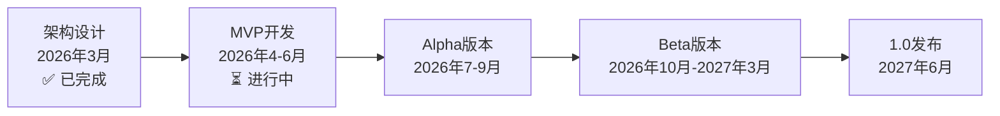

# Quest - AI原生游戏引擎

<div align="center">

**通过对话创造游戏，效率提升10倍**

[](https://opensource.org/licenses/MIT)
[]()
[]()

[文档](docs/README.md) • [架构设计](docs/01-architecture/overview.md) • [路线图](docs/06-implementation/roadmap.md) • [参考资料](docs/07-references/index.md)

</div>

---

## 🌟 什么是Quest？

Quest是全球**首个AI驱动型游戏引擎**，通过自然语言对话驱动游戏开发，而非传统的手动编辑器操作。

### 传统开发 vs Quest开发

```
传统方式创建场景：
  1. 打开编辑器
  2. 手动拖拽对象
  3. 配置属性
  4. 调整参数
  5. 测试优化
  ⏱️ 耗时：2小时

Quest方式：
  对话："创建森林场景，有树木、小屋和友好的NPC"
  ⏱️ 耗时：30秒
  
  效率提升：240倍 🚀
```

---

## ✨ 核心特性

### 🤖 对话驱动开发
通过自然语言描述，AI自动生成完整游戏内容
```
你: "创建一个会飞的龙Boss，有三个阶段"
Quest: [自动生成] → 龙模型 + AI行为 + 技能系统 → 完成
```

### 📝 Prompt-as-Source
提示词作为资产的"源代码"，支持版本控制
```
forest-scene.prompt.md
├─ v1.0: 初始森林场景
├─ v1.1: 增加溪流
└─ v1.2: 优化光照

无需保留PSD、FBX等中间文件！
```

### 🎨 语义化API
用概念描述，AI自动实现技术细节
```typescript
// 传统API: 50行代码
const node = new cc.Node();
node.setPosition(100, 200, 0);
// ... 48行

// Quest语义化API: 1行代码
const hero = await quest.create({ type: 'character' });

代码减少：98%
```

### 🎯 Multi-Agent协作
6个专家Agent分工合作，高效生成
```
主Agent → 任务分解
  ├─ 场景Agent → 生成关卡
  ├─ NPC Agent → 设计角色
  ├─ 对话Agent → 编写剧情
  └─ 评估Agent → 质量保证
```

### 🔧 MCP工具生态
集成3200+ MCP工具，能力无限扩展
```
- 文件操作
- Git版本控制
- 浏览器自动化
- 图像生成
- ... 3200+ 更多
```

### ⚡ 跨平台高性能
基于Cocos 4 C++引擎，支持Web + 原生平台
```
一次开发，导出到：
✅ Web (H5)
✅ iOS (Metal原生)
✅ Android (Vulkan原生)
✅ Desktop (Windows/Mac/Linux)
```

---

## 🏗️ 架构亮点

### 五层架构设计

```
┌─────────────────────────────────────┐
│ 用户交互层：Electron编辑器          │
├─────────────────────────────────────┤
│ AI智能层：Multi-Agent + Skill + MCP │
├─────────────────────────────────────┤
│ 语义抽象层：语义化API（核心创新）   │
├─────────────────────────────────────┤
│ 引擎适配层：Cocos 4 TypeScript封装  │
├─────────────────────────────────────┤
│ 渲染运行时：Cocos 4 C++引擎         │
└─────────────────────────────────────┘
```

详见：[架构文档](docs/01-architecture/overview.md)

---

## 🚀 快速开始

### 克隆项目

```bash
# 克隆Quest项目（包含Cocos4 submodule）
git clone --recursive https://github.com/你的用户名/Quest

# 或分步克隆
git clone https://github.com/你的用户名/Quest
cd Quest
git submodule init
git submodule update
```

### Cocos 4引擎集成

Quest使用**Git Submodule**方式集成Cocos 4引擎：

- **Quest主项目**: `e:\Quest` (主Git仓库)
- **Cocos 4引擎**: `e:\Quest\engine` (Git Submodule)
  - Fork仓库: https://github.com/QwincyLi/engine
  - 上游仓库: https://github.com/cocos/cocos4
  - 当前版本: v4.0.0-alpha.7

**更新Cocos 4引擎**:
```bash
cd engine
git pull origin v4.0.0
cd ..
git add engine
git commit -m "Update Cocos4 engine"
```

### 安装和开发（未来）

```bash
# 安装依赖
npm install

# 启动开发模式
npm run dev
```

然后通过对话创建游戏：
```
你: "创建一个平台跳跃游戏"
Quest: [生成完整游戏框架] ✅

你: "添加10个平台和5个敌人"
Quest: [自动生成并优化] ✅

你: "测试游戏"
Quest: [自动运行测试] ✅

总耗时: <5分钟
传统方式: 2-3天
```

详见：[快速开始指南](docs/05-guides/getting-started.md)

---

## 📚 文档

### 核心文档
- 📖 [文档导航](docs/README.md) - 从这里开始
- 🏗️ [架构总览](docs/01-architecture/overview.md) - 系统设计
- 🤖 [Agent系统](docs/02-agent-system/complete.md) - AI核心
- 🎨 [语义化API](docs/03-semantic-api/complete.md) - 核心创新
- 📘 [API参考](docs/04-api-reference/complete.md) - 完整API
- 🚀 [实施路线图](docs/06-implementation/roadmap.md) - 开发计划

### 快速链接
- [为什么选择Cocos 4？](docs/01-architecture/tech-stack.md#为什么选择cocos-4)
- [为什么自研Agent系统？](docs/01-architecture/tech-stack.md#为什么自研agent系统)
- [什么是语义化API？](docs/03-semantic-api/principles.md)
- [参考资料](docs/07-references/index.md)

---

## 🛠️ 技术栈

| 层次 | 技术选型 | 说明 |
|------|---------|------|
| **编辑器** | Electron + React + TypeScript | 跨平台桌面应用 |
| **后端** | Node.js + Fastify | 高性能API服务 |
| **Agent** | 自研Multi-Agent框架 | 完全可控 |
| **LLM** | OpenRouter | 300+模型统一接口 |
| **引擎** | Cocos 4 (MIT fork) | 高性能跨平台 |
| **工具** | MCP协议 | 3200+工具生态 |
| **存储** | Redis + Pinecone + PostgreSQL | 混合存储 |

详见：[技术栈对比](docs/01-architecture/tech-stack.md)

---

## 🗺️ 开发状态

### 当前阶段：架构设计 ✅

- [x] 完成完整架构设计
- [x] 完成Agent系统设计
- [x] 完成语义化API规范
- [x] 完成技术选型
- [x] 完成开发路线图

### 下一阶段：MVP开发

- [ ] 基础架构搭建（1个月）
- [ ] Agent系统实现（1个月）
- [ ] 语义API实现（1个月）
- [ ] MVP发布（2026年6月）

完整路线图：[实施路线图](docs/06-implementation/roadmap.md)

---

## 💡 核心创新点

### 1. AI原生语义化API（全球首创）
用人类和AI都能理解的概念描述游戏，代码减少98%

### 2. Prompt-as-Source资产范式
提示词即源码，消除PSD/FBX等中间产物，版本控制更简单

### 3. Multi-Agent + Skill + MCP
自研Agent系统，动态加载Skill，集成3200+ MCP工具

### 4. AI质量评估管道
自动评估生成质量，生成满意度从60% → 95%

---

## 🎯 项目定位

Quest属于**AI驱动型游戏引擎**（技术路线2），介于AI辅助型和AI自主型之间：

```
路线1（AI辅助）: Unity Muse - AI作为辅助工具
路线2（AI驱动）: Quest - AI作为核心驱动力 ⭐ Quest在这里
路线3（AI自主）: Genie - AI完全自主创作
```

对比：
- vs Unity Muse：完全重构工作流（非插件）
- vs 传统引擎：效率提升5-10倍，门槛降低10倍
- vs AI自主型：保留人类创意控制

---

## 📖 示例代码

### 创建游戏对象

```typescript
// 创建角色
const hero = await quest.create({
  type: 'character',
  name: 'Hero',
  appearance: 'warrior',
  position: 'center',
  behaviors: ['walkable', 'attackable'],
});

// 创建敌人
const goblin = await quest.create({
  type: 'enemy',
  species: 'goblin',
  threat: 'low',
  behavior: 'patrol',
});
```

### 创建场景

```typescript
const forest = await quest.createScene({
  name: 'ForestLevel',
  environment: {
    timeOfDay: 'afternoon',
    weather: 'clear',
    lighting: 'warm',
  },
  objects: [
    { type: 'tree', count: 30, distribution: 'random' },
    { type: 'cabin', position: { x: 50, y: 50 } },
    { type: 'npc', occupation: 'woodcutter', personality: 'friendly' },
  ],
});
```

### 对话式开发

```typescript
// 在编辑器中对话
用户: "让这个敌人更强一点"
Quest: [AI理解意图] → [自动修改] → 完成

用户: "添加一个宝箱，里面有稀有武器"
Quest: [生成宝箱] → [生成战利品系统] → [配置掉落] → 完成
```

更多示例见：[API文档](docs/04-api-reference/complete.md)

---

## 🎓 学习资源

### 文档
- [架构设计](docs/01-architecture/) - 了解系统设计
- [Agent系统](docs/02-agent-system/) - 了解AI核心
- [语义化API](docs/03-semantic-api/) - 核心创新
- [使用指南](docs/05-guides/) - 实战教程

### 参考
- [学术论文](docs/07-references/index.md#学术研究) - 6篇相关研究
- [技术基础](docs/07-references/index.md#技术基础) - MCP、Cocos 4等
- [经典理论](docs/07-references/index.md#经典理论) - DSL、声明式编程

---

## 🤝 参与贡献

Quest是开源项目，欢迎各种形式的贡献！

### 特别需要
- 🎨 **Skill开发** - 游戏设计Skill（Markdown格式）
- 🔧 **MCP服务器** - 新工具集成
- 📖 **文档改进** - 教程、翻译
- 🐛 **Bug报告** - 发现问题

### 贡献方式
1. Fork本仓库
2. 创建功能分支
3. 提交PR
4. 代码审查

---

## 📁 项目结构

```
Quest/
├── README.md                # 项目总览（本文件）
├── LICENSE                  # MIT许可证
│
├── docs/                    # 📚 完整文档
│   ├── 01-architecture/    # 架构设计
│   ├── 02-agent-system/    # Agent系统
│   ├── 03-semantic-api/    # 语义化API
│   ├── 04-api-reference/   # API参考
│   ├── 05-guides/          # 使用指南
│   ├── 06-implementation/  # 实施计划
│   └── 07-references/      # 参考资料
│
├── packages/               # 源代码（未来）
│   ├── editor/            # 编辑器
│   ├── agent-core/        # Agent系统
│   ├── semantic-api/      # 语义化API
│   └── cocos4-adapter/    # Cocos 4适配器
│
└── examples/              # 示例项目（未来）
    ├── hello-quest/       # Hello World
    ├── platformer/        # 平台跳跃游戏
    └── rpg-starter/       # RPG起始模板
```

---

## 🚀 开发路线图



详细计划：[实施路线图](docs/06-implementation/roadmap.md)

---

## 🎯 核心优势

### vs 传统游戏引擎

| 维度 | 传统引擎 | Quest引擎 | 提升 |
|------|---------|----------|------|
| **开发效率** | 基准 | 5-10倍 | 🚀 |
| **学习门槛** | 高（需编程） | 低（自然语言） | 📉 10倍 |
| **代码量** | 基准 | 减少98% | 📊 |
| **AI友好性** | 差 | 优 | ✅ |
| **资产管理** | 复杂（多中间产物） | 简单（Prompt） | 🎯 |

### vs AI辅助型引擎（Unity Muse）

| 特性 | Unity Muse | Quest |
|------|-----------|-------|
| **核心理念** | AI辅助传统流程 | AI驱动新流程 |
| **主要交互** | 手动编辑器 | AI对话 |
| **效率提升** | 1.2倍 | 5-10倍 |
| **工作流** | 传统 | 全新 |

---

## 📄 许可证

MIT License - 完全开源，可商用

详见：[LICENSE](LICENSE)

---

## 🔗 相关链接

- **文档**: [完整文档](docs/README.md)
- **架构**: [架构设计](docs/01-architecture/overview.md)
- **API**: [API参考](docs/04-api-reference/complete.md)
- **路线图**: [开发计划](docs/06-implementation/roadmap.md)
- **参考**: [学术研究](docs/07-references/index.md)

---

## 📧 联系方式

- **GitHub**: [quest-engine/quest](https://github.com/quest-engine/quest)（未来）
- **Discord**: [加入社区](https://discord.gg/quest)（未来）
- **Email**: team@quest-engine.ai（未来）
- **Twitter**: [@QuestEngine](https://twitter.com/QuestEngine)（未来）

---

## ⭐ Star历史

如果Quest对你有帮助，请给我们一个Star！

[](https://starchart.cc/quest-engine/quest)

---

## 🙏 致谢

Quest的诞生受到以下项目和研究的启发：

- [Cocos 4](https://github.com/cocos/cocos4) - MIT开源游戏引擎
- [OpenClaw](https://robotpaper.ai/reference-architecture-openclaw) - Agent架构参考
- [Model Context Protocol](https://www.anthropic.com/research/model-context-protocol) - Anthropic的工具协议
- [Prompt-Driven Development](https://github.com/promptdriven/pdd/) - PDD理念
- Martin Fowler - DSL设计理论
- Kubernetes - 声明式API哲学

完整参考资料：[References](docs/07-references/index.md)

---

<div align="center">

**Quest - 重新定义游戏开发**

Made with ❤️ by Quest Team

</div>
