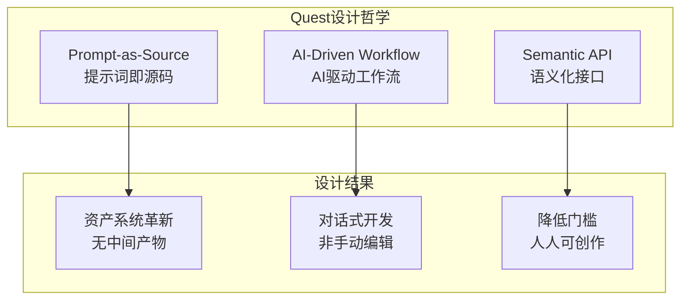
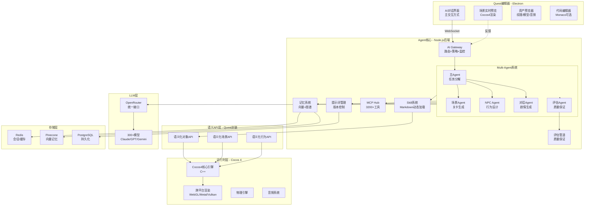
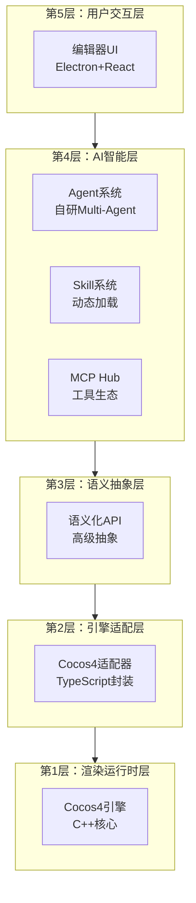
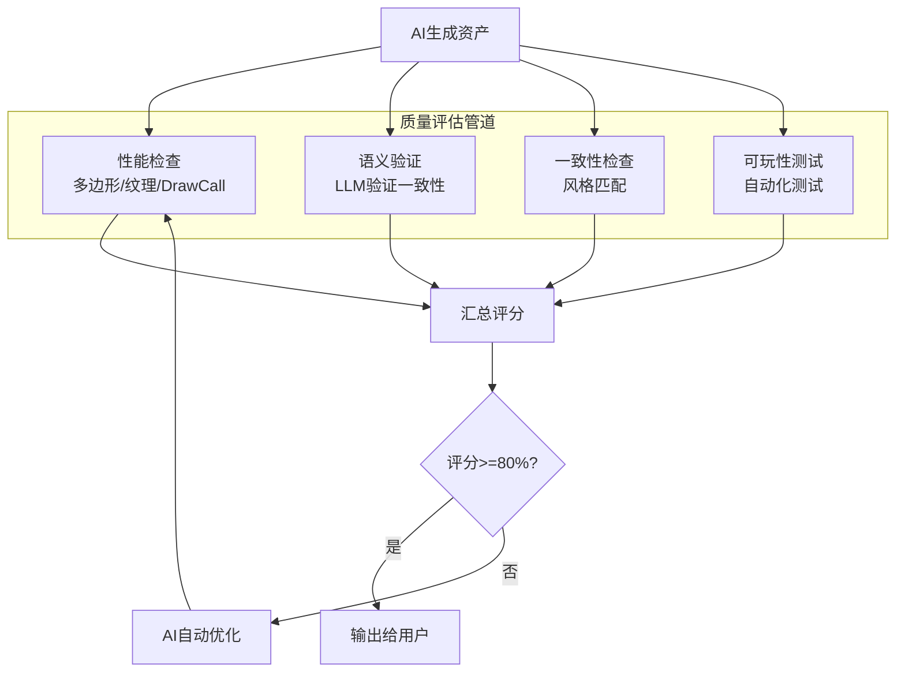

# Quest AI原生游戏引擎 - 完整架构设计

> **技术路线定位**: AI驱动型游戏引擎（AI-Driven Game Engine）  
> **核心理念**: Prompt-as-Source + 语义化API + Multi-Agent协作  
> **底层引擎**: Cocos 4 (MIT)  
> **目标**: 通过对话驱动游戏开发，效率提升5-10倍

---

## 目录

- [1. 架构总览](#1-架构总览)
- [2. 技术路线定位](#2-技术路线定位)
- [3. 系统分层架构](#3-系统分层架构)
- [4. 核心模块设计](#4-核心模块设计)
- [5. 技术栈选型](#5-技术栈选型)
- [6. 开发路线图](#6-开发路线图)
- [7. 参考资料](#7-参考资料)

---

## 1. 架构总览

### 1.1 设计哲学

Quest引擎基于三大核心理念：



**核心价值主张**:
- **效率革命**: 5-10倍开发速度提升
- **门槛降低**: 非程序员也能创作游戏
- **AI原生**: 为大模型优化的全新架构

### 1.2 系统全景图



---

## 2. 技术路线定位

### 2.1 AI原生游戏引擎的四种技术路线

| 路线 | 代表产品 | AI参与度 | 人类控制 | 技术成熟度 | Quest定位 |
|------|---------|---------|---------|-----------|----------|
| **路线1: AI辅助型** | Unity Muse | 10-30% | 完全 | ✅ 成熟 | ❌ |
| **路线2: AI驱动型** | **Quest** | 60-80% | 高度 | ⚠️ 可用 | ✅ **主路线** |
| **路线3: AI自主型** | DeepMind Genie | 95%+ | 低 | ❌ 研究中 | ❌ |
| **路线4: AI共生型** | 未来方向 | 50-70%（深度） | 协作 | ❌ 概念 | ⚠️ 部分特性 |

### 2.2 Quest的技术路线特征

**核心定位**: 路线2（AI驱动型）+ 路线4的前瞻特性

```
Quest = AI驱动型引擎
  ├─ 对话式交互为主（vs 手动编辑）
  ├─ 提示词驱动生成（vs 手动创建）
  ├─ AI Agent核心编排（vs 辅助插件）
  ├─ 轻量化编辑器（vs 复杂IDE）
  └─ 运行时资产优先（vs 中间产物）

+ 共生型特性
  ├─ Multi-Agent协作
  ├─ Skill动态加载
  ├─ 自修改工作流
  └─ MCP工具生态
```

### 2.3 与竞品对比

```mermaid
graph LR
    subgraph traditional[传统引擎]
        unity[Unity]
        unreal[Unreal]
    end
    
    subgraph aiAssisted[AI辅助型]
        muse[Unity Muse]
        copilot[Unreal Copilot]
    end
    
    subgraph aiDriven[AI驱动型]
        quest[Quest]
        rosebud[Rosebud AI]
    end
    
    traditional -->|添加AI插件| aiAssisted
    aiAssisted -.效率1.2x.-> result1[传统工作流]
    
    quest -.效率5-10x.-> result2[新工作流]
    
    quest -->|领先优势| advantages[开放生态<br/>跨平台<br/>语义化API<br/>Multi-Agent]
```

**Quest的差异化优势**:
1. **vs Unity Muse**: 完全重构工作流（非插件）
2. **vs Rosebud AI**: 开放生态 + 跨平台 + 更强大的Agent系统
3. **vs 传统引擎**: 效率提升5-10倍 + 门槛降低10倍

---

## 3. 系统分层架构

### 3.1 五层架构设计



### 3.2 各层职责详解

#### 第5层：用户交互层（编辑器）

**技术栈**: Electron + React + Monaco Editor

**核心组件**:
```typescript
// 编辑器模块架构
const EditorModules = {
  // 主交互界面
  ai: {
    chatPanel: 'AI对话面板（主要交互方式）',
    toolsPanel: 'AI工具箱（生成/优化）',
    suggestionEngine: 'AI建议引擎',
  },
  
  // 预览系统
  preview: {
    scenePreview: '场景实时预览（Cocos4渲染）',
    assetPreview: '资产预览器（纹理/模型/音频/字体）',
    gamePreview: '游戏运行预览',
  },
  
  // 资产管理
  assets: {
    browser: '资产浏览器',
    promptEditor: '提示词编辑器（核心）',
    versionControl: '提示词版本控制',
  },
  
  // 开发工具（可选）
  dev: {
    codeEditor: '代码编辑器（Monaco）',
    debugger: '调试器',
    console: '控制台',
  },
};
```

**设计原则**:
- ✅ **对话优先**: AI对话是主要交互方式
- ✅ **轻量化**: 不需要复杂的手动编辑工具
- ✅ **实时预览**: 所见即所得
- ✅ **提示词中心**: 编辑提示词而非直接编辑资产

---

#### 第4层：AI智能层（Agent核心）

**技术栈**: Node.js + 自研Agent框架

**架构设计**:

```typescript
// src/agent-core/architecture.ts

export class QuestAgentCore {
  // 1. AI Gateway（中心化控制）
  private gateway: AIGateway;
  
  // 2. Multi-Agent系统
  private agents: {
    master: MasterAgent;      // 主Agent：任务分解
    scene: SceneAgent;        // 场景Agent：关卡生成
    npc: NPCAgent;           // NPC Agent：角色设计
    dialogue: DialogueAgent;  // 对话Agent：剧情生成
    code: CodeAgent;         // 代码Agent：脚本生成
    eval: EvaluationAgent;   // 评估Agent：质量保证
  };
  
  // 3. Skill系统（动态加载）
  private skillRegistry: SkillRegistry;
  
  // 4. MCP Hub（工具生态）
  private mcpHub: MCPHub;
  
  // 5. 提示词管理系统（新增）
  private promptManager: PromptManagementSystem;
  
  // 6. 记忆系统
  private memory: MemorySystem;
  
  // 7. 质量评估管道（新增）
  private evaluationPipeline: EvaluationPipeline;
  
  // 主要工作流
  async processUserRequest(message: string): Promise<Response> {
    // 1. 解析用户意图
    const intent = await this.gateway.parseIntent(message);
    
    // 2. 选择合适的Agent
    const agent = this.selectAgent(intent);
    
    // 3. 加载所需Skill
    const skills = await this.skillRegistry.loadSkills(intent.requiredSkills);
    
    // 4. 执行生成
    const generated = await agent.execute({
      intent,
      skills,
      mcpTools: this.mcpHub.getTools(),
      memory: this.memory,
    });
    
    // 5. 质量评估（新增）
    const evaluated = await this.evaluationPipeline.evaluate(generated);
    
    // 6. 如果评估失败，自动优化
    if (!evaluated.passed) {
      return await this.autoOptimize(generated, evaluated.issues);
    }
    
    // 7. 保存提示词（版本控制）
    await this.promptManager.savePrompt({
      content: message,
      result: generated,
      version: 'auto',
    });
    
    return generated;
  }
}
```

**关键特性**:
- ✅ **动态工作流**: Agent可以在运行时修改执行流程
- ✅ **自我优化**: 评估管道自动发现和修复问题
- ✅ **持久化记忆**: 跨会话的长期记忆
- ✅ **工具生态**: 3200+ MCP工具可用

---

#### 第3层：语义抽象层（核心创新）

**这是Quest的核心创新层，将底层技术细节抽象为AI可理解的语义概念**

**设计原则**:

```typescript
// 语义化API的三大设计原则

// 原则1: 声明式（What not How）
// ❌ 命令式
const node = new cc.Node();
node.setPosition(100, 200, 0);
node.addComponent(cc.Sprite);

// ✅ 声明式
const character = await quest.create({
  type: 'character',
  position: 'center',
  appearance: 'warrior',
});

// 原则2: 语义化（Concept not Technical）
// ❌ 技术术语
enemy.aggroRange = 15;
enemy.attackDamage = 25;

// ✅ 语义概念
enemy = quest.create({
  type: 'enemy',
  threat: 'medium',      // AI理解：中等威胁
  behavior: 'aggressive', // AI理解：攻击性
});

// 原则3: 可组合（Composable）
// ✅ 语义可以组合
const boss = quest.compose([
  { type: 'enemy', threat: 'extreme' },
  { behavior: 'phase-based' },
  { skills: ['teleport', 'summon-minions'] },
]);
```

**语义API模块**:

```typescript
// src/semantic-api/index.ts

export class QuestSemanticAPI {
  // 游戏对象API
  async createGameObject(descriptor: GameObjectDescriptor): Promise<GameObject>;
  async modifyGameObject(id: string, changes: Partial<GameObjectDescriptor>): Promise<void>;
  async findGameObjects(query: SemanticQuery): Promise<GameObject[]>;
  
  // 场景API
  async createScene(descriptor: SceneDescriptor): Promise<Scene>;
  async modifyScene(id: string, changes: Partial<SceneDescriptor>): Promise<void>;
  
  // 行为API
  async attachBehavior(objectId: string, behavior: BehaviorDescriptor): Promise<void>;
  async createBehaviorTree(tree: BehaviorTreeDescriptor): Promise<BehaviorTree>;
  
  // 资产API
  async generateAsset(prompt: AssetPrompt): Promise<Asset>;
  async optimizeAsset(assetId: string): Promise<Asset>;
}

// 类型定义示例
interface GameObjectDescriptor {
  type: 'character' | 'prop' | 'terrain' | 'enemy' | 'npc';
  name?: string;
  
  // 外观（语义化）
  appearance?: {
    sprite?: string | AssetPrompt;
    model?: string | AssetPrompt;
    scale?: number | 'small' | 'medium' | 'large';
  };
  
  // 位置（语义化）
  position?: {
    x: number;
    y: number;
    z?: number;
  } | 'center' | 'random' | 'near-player' | 'opposite-to-player';
  
  // 行为（语义化）
  behaviors?: Array<
    'walkable' | 'flyable' | 'attackable' | 'interactable' | 
    'collidable' | 'gravity-affected' | BehaviorDescriptor
  >;
  
  // 属性（语义化）
  attributes?: {
    health?: number | 'low' | 'medium' | 'high';
    speed?: number | 'slow' | 'medium' | 'fast';
    damage?: number | 'weak' | 'medium' | 'strong';
  };
  
  // 允许精确控制（override语义推理）
  overrides?: Record<string, any>;
}
```

**语义映射规则引擎**:

```typescript
// src/semantic-api/semantic-mapper.ts

export class SemanticMapper {
  private rules: Map<string, SemanticRule> = new Map();
  
  // 注册语义规则
  registerRule(semantic: string, rule: SemanticRule) {
    this.rules.set(semantic, rule);
  }
  
  // 解析语义并推理具体实现
  async resolve(descriptor: any): Promise<ConcreteImplementation> {
    const impl = {};
    
    // 示例：解析 threat: 'medium'
    if (descriptor.threat === 'medium') {
      impl.health = this.randomInRange(80, 120);
      impl.damage = this.randomInRange(20, 30);
      impl.speed = this.randomInRange(2.5, 3.5);
      impl.aggroRange = this.randomInRange(12, 18);
    }
    
    // 处理override
    if (descriptor.overrides) {
      Object.assign(impl, descriptor.overrides);
    }
    
    return impl;
  }
}

// 预定义语义规则
const defaultSemanticRules = {
  // 威胁等级
  'threat-low': { health: [30, 50], damage: [5, 10], speed: [1, 2] },
  'threat-medium': { health: [80, 120], damage: [20, 30], speed: [2.5, 3.5] },
  'threat-high': { health: [150, 250], damage: [40, 60], speed: [3, 5] },
  'threat-boss': { health: [500, 1000], damage: [80, 150], speed: [2, 4] },
  
  // 尺寸
  'size-small': { scale: [0.5, 0.8] },
  'size-medium': { scale: [0.9, 1.1] },
  'size-large': { scale: [1.5, 2.5] },
  
  // 速度
  'speed-slow': { moveSpeed: [1, 2] },
  'speed-medium': { moveSpeed: [3, 5] },
  'speed-fast': { moveSpeed: [6, 10] },
};
```

---

#### 第2层：引擎适配层

**职责**: 将语义化API转换为Cocos 4的原生调用

```typescript
// src/runtime/cocos4-adapter.ts

export class Cocos4Adapter {
  // 将语义化的GameObject转换为Cocos4 Node
  async createNode(descriptor: GameObjectDescriptor): Promise<cc.Node> {
    const node = new cc.Node(descriptor.name || 'GameObject');
    
    // 处理位置（语义 → 坐标）
    const position = await this.resolvePosition(descriptor.position);
    node.setPosition(position);
    
    // 处理外观
    if (descriptor.appearance?.sprite) {
      const sprite = node.addComponent(cc.Sprite);
      sprite.spriteFrame = await this.loadOrGenerateAsset(
        descriptor.appearance.sprite
      );
    }
    
    // 处理行为
    if (descriptor.behaviors) {
      for (const behavior of descriptor.behaviors) {
        await this.attachBehavior(node, behavior);
      }
    }
    
    return node;
  }
  
  // 语义位置解析
  private async resolvePosition(
    pos: PositionDescriptor
  ): Promise<cc.Vec3> {
    // 字符串语义
    if (typeof pos === 'string') {
      switch (pos) {
        case 'center':
          return this.getScreenCenter();
        case 'random':
          return this.getRandomPosition();
        case 'near-player':
          const player = this.findPlayer();
          return this.getNearbyPosition(player.position, 5);
        case 'opposite-to-player':
          const p = this.findPlayer();
          return this.getOppositePosition(p.position);
      }
    }
    
    // 具体坐标
    return new cc.Vec3(pos.x, pos.y, pos.z || 0);
  }
  
  // 行为附加（语义 → 组件）
  private async attachBehavior(
    node: cc.Node,
    behavior: string | BehaviorDescriptor
  ): Promise<void> {
    if (typeof behavior === 'string') {
      switch (behavior) {
        case 'walkable':
          node.addComponent(MovementComponent);
          node.addComponent(cc.Animation);
          break;
        case 'collidable':
          const collider = node.addComponent(cc.BoxCollider2D);
          collider.size = this.estimateColliderSize(node);
          break;
        case 'gravity-affected':
          const rb = node.addComponent(cc.RigidBody2D);
          rb.gravityScale = 1;
          break;
      }
    } else {
      // 复杂行为描述
      await this.createComplexBehavior(node, behavior);
    }
  }
}
```

---

#### 第1层：渲染运行时层（Cocos 4）

**直接使用，不改造**

Cocos 4提供的能力：
- ✅ C++高性能渲染器
- ✅ 跨平台支持（Web/iOS/Android/Desktop）
- ✅ WebGL/Metal/Vulkan多后端
- ✅ 物理引擎（Box2D）
- ✅ 音频系统
- ✅ 动画系统
- ✅ 粒子系统

**集成方式**:
```typescript
// Quest运行时启动
import * as cc from 'cocos4';

export class QuestRuntime {
  async initialize(config: RuntimeConfig) {
    // 初始化Cocos4引擎
    await cc.game.init({
      canvas: config.canvas,
      debugMode: config.debug,
    });
    
    // 加载场景（从提示词生成）
    const sceneDescriptor = await this.loadPrompt(config.initialScene);
    const scene = await this.semanticAPI.createScene(sceneDescriptor);
    
    // 运行场景
    cc.director.runScene(scene);
  }
}
```

---

## 4. 核心模块设计

### 4.1 AI Gateway（中心化控制）

**设计借鉴**: OpenClaw的Gateway模式 + AI-Native Architecture Patterns 2026

```typescript
// src/agent-core/gateway.ts

export class AIGateway {
  private sessionManager: SessionManager;
  private modelRouter: ModelRouter;
  private safetyGuard: SafetyGuard;
  private observability: ObservabilityLogger;
  
  // WebSocket中心化控制
  async handleMessage(sessionId: string, message: string): Promise<Response> {
    // 1. 获取会话
    const session = await this.sessionManager.getSession(sessionId);
    
    // 2. 安全检查
    const isSafe = await this.safetyGuard.check(message);
    if (!isSafe) {
      return { error: '请求包含不安全内容' };
    }
    
    // 3. 选择最优模型（策略）
    const model = await this.modelRouter.selectModel({
      complexity: this.estimateComplexity(message),
      budget: session.budget,
      latency: session.latencyRequirement,
    });
    
    // 4. 执行Agent工作流
    const result = await this.executeWorkflow({
      message,
      model,
      session,
    });
    
    // 5. 记录可观测性数据
    await this.observability.log({
      sessionId,
      message,
      model,
      result,
      timestamp: Date.now(),
    });
    
    return result;
  }
  
  // 智能模型路由
  async selectModel(criteria: ModelCriteria): Promise<string> {
    // 复杂任务 → 强模型
    if (criteria.complexity === 'high') {
      return 'anthropic/claude-3-opus';
    }
    
    // 简单任务 → 快模型（省钱）
    if (criteria.complexity === 'low') {
      return 'anthropic/claude-3-haiku';
    }
    
    // 中等任务 → 平衡模型
    return 'anthropic/claude-3.5-sonnet';
  }
}
```

---

### 4.2 Skill系统（动态加载）

**设计灵感**: OpenClaw的Skills-as-Markdown

**核心特性**: Skill作为Markdown资产，支持热加载和组合

```typescript
// src/skill-system/skill-registry.ts

export class SkillRegistry {
  private skills: Map<string, Skill> = new Map();
  private mcpHub: MCPHub;
  
  // 从Markdown加载Skill
  async loadSkillFromMarkdown(path: string): Promise<Skill> {
    const content = await fs.readFile(path, 'utf-8');
    const parsed = this.parseSkillMarkdown(content);
    
    return {
      id: parsed.metadata.id,
      name: parsed.metadata.name,
      description: parsed.metadata.description,
      category: parsed.metadata.category,
      version: parsed.metadata.version,
      
      // Prompt是Skill的核心
      prompt: parsed.prompt,
      
      // Skill可以声明需要的MCP工具
      requiredTools: parsed.metadata.tools || [],
      
      // 参数Schema
      schema: this.parseSchema(parsed.parameters),
      
      // 执行函数
      execute: async (params, context) => {
        // 准备MCP工具
        const tools = await this.mcpHub.getTools(this.requiredTools);
        
        // 调用LLM执行Skill
        const result = await context.llm.generate({
          systemPrompt: this.prompt,
          userInput: JSON.stringify(params),
          tools,
        });
        
        return result;
      },
    };
  }
  
  // Skill组合（高级特性）
  composeSkills(skillIds: string[]): Skill {
    const skills = skillIds.map(id => this.skills.get(id)!);
    
    return {
      id: `composed_${skillIds.join('_')}`,
      name: skills.map(s => s.name).join(' + '),
      prompt: skills.map(s => s.prompt).join('\n\n---\n\n'),
      requiredTools: Array.from(new Set(
        skills.flatMap(s => s.requiredTools)
      )),
      execute: async (params, context) => {
        // 链式执行多个Skill
        let result = params;
        for (const skill of skills) {
          result = await skill.execute(result, context);
        }
        return result;
      },
    };
  }
}
```

**Skill Markdown格式规范**:

```markdown
---
id: npc-behavior-designer
name: NPC行为设计器
category: game-design
version: 1.2.0
tools:
  - create_behavior_tree
  - create_state_machine
  - generate_animation
---

# NPC行为设计技能

## 描述
根据用户描述，设计NPC的完整行为系统，包括行为树、状态机和动画。

## 参数
- npcType: string - NPC类型（enemy/friendly/merchant/quest-giver）
- personality: string - 性格描述
- behaviors: string[] - 需要的行为能力

## Prompt

你是一个专业的游戏NPC行为设计师。请根据以下需求设计NPC行为系统：

**NPC类型**: {npcType}
**性格特征**: {personality}
**需要的行为**: {behaviors}

请生成以下内容：

1. **行为树JSON结构**（符合Quest引擎规范）
2. **状态机定义**（主要状态和转换条件）
3. **动画列表**（需要的动画片段）
4. **TypeScript行为脚本**（可选的高级逻辑）

使用以下MCP工具：
- `create_behavior_tree`: 创建行为树节点
- `create_state_machine`: 创建状态机
- `generate_animation`: 生成动画描述

确保设计符合游戏平衡性和玩家体验。

## 示例

输入:
```json
{
  "npcType": "merchant",
  "personality": "贪婪但胆小",
  "behaviors": ["trade", "flee-on-danger"]
}
```

输出:
```json
{
  "behaviorTree": { ... },
  "stateMachine": { ... },
  "animations": ["idle", "trade", "flee"],
  "script": "// TypeScript代码"
}
```
```

---

### 4.3 MCP Hub（工具生态）

**设计参考**: Anthropic的Model Context Protocol

```typescript
// src/mcp-hub/mcp-hub.ts

export class MCPHub {
  private servers: Map<string, MCPServerConnection> = new Map();
  private tools: Map<string, MCPTool> = new Map();
  
  // 连接MCP服务器
  async connectServer(config: MCPServerConfig): Promise<void> {
    const client = new MCPClient({
      name: 'quest-agent',
      version: '1.0.0',
    });
    
    await client.connect(config.transport);
    
    // 获取服务器提供的工具
    const { tools } = await client.listTools();
    
    // 注册工具
    for (const tool of tools) {
      this.tools.set(`${config.id}:${tool.name}`, {
        serverId: config.id,
        name: tool.name,
        description: tool.description,
        inputSchema: tool.inputSchema,
        call: async (params) => {
          return await client.callTool({
            name: tool.name,
            arguments: params,
          });
        },
      });
    }
    
    this.servers.set(config.id, { client, config });
  }
  
  // 预置的游戏引擎MCP工具
  private async setupGameEngineTools(): Promise<void> {
    // Cocos 4 API工具
    await this.connectServer({
      id: 'cocos4',
      transport: { type: 'stdio', command: 'quest-cocos4-mcp' },
    });
    
    // 常用MCP工具
    await this.connectServer({
      id: 'filesystem',
      transport: { type: 'stdio', command: 'mcp-server-filesystem' },
    });
    
    await this.connectServer({
      id: 'git',
      transport: { type: 'stdio', command: 'mcp-server-git' },
    });
  }
  
  // 动态安装ClawHub技能
  async installFromClawHub(skillName: string): Promise<void> {
    const config = await this.fetchFromClawHub(skillName);
    await this.connectServer(config);
  }
  
  // 获取工具（供Agent使用）
  getTools(filter?: ToolFilter): MCPTool[] {
    let tools = Array.from(this.tools.values());
    
    if (filter?.categories) {
      tools = tools.filter(t =>
        filter.categories.some(cat => t.description.includes(cat))
      );
    }
    
    return tools;
  }
}

// Cocos 4的MCP工具定义
const cocos4MCPTools = [
  {
    name: 'create_node',
    description: '在场景中创建节点',
    inputSchema: {
      type: 'object',
      properties: {
        name: { type: 'string' },
        type: { type: 'string', enum: ['sprite', '3d-model', 'empty'] },
        position: { type: 'object' },
      },
    },
  },
  {
    name: 'add_component',
    description: '为节点添加组件',
    inputSchema: {
      type: 'object',
      properties: {
        nodeId: { type: 'string' },
        componentType: { type: 'string' },
        config: { type: 'object' },
      },
    },
  },
  // ... 更多工具
];
```

---

### 4.4 提示词管理系统（借鉴PDD）

**新增模块，受PDD框架启发**

```typescript
// src/prompt-management/prompt-manager.ts

export class PromptManagementSystem {
  private db: Database;
  private vcs: VersionControlSystem;
  
  // 保存提示词（自动版本控制）
  async savePrompt(prompt: PromptAsset): Promise<string> {
    // 生成提示词ID
    const id = this.generateId(prompt);
    
    // 计算版本号
    const version = await this.vcs.getNextVersion(id);
    
    // 保存到数据库
    await this.db.save({
      id,
      version,
      content: prompt.content,
      type: prompt.type,
      generatedAssets: prompt.result,
      timestamp: Date.now(),
      metadata: prompt.metadata,
    });
    
    // Git式版本控制
    await this.vcs.commit({
      id,
      version,
      message: `Auto-save: ${prompt.content.slice(0, 50)}...`,
    });
    
    return `${id}@${version}`;
  }
  
  // 提示词对比（Git diff风格）
  async diffPrompts(v1: string, v2: string): Promise<PromptDiff> {
    const prompt1 = await this.loadPrompt(v1);
    const prompt2 = await this.loadPrompt(v2);
    
    return {
      contentDiff: this.textDiff(prompt1.content, prompt2.content),
      resultDiff: this.assetDiff(prompt1.result, prompt2.result),
      metadata: {
        v1: { version: v1, timestamp: prompt1.timestamp },
        v2: { version: v2, timestamp: prompt2.timestamp },
      },
    };
  }
  
  // 提示词回滚
  async rollback(promptId: string, toVersion: string): Promise<void> {
    const historical = await this.loadPrompt(`${promptId}@${toVersion}`);
    
    // 重新生成资产
    const regenerated = await this.aiAgent.generate(historical.content);
    
    // 保存为新版本
    await this.savePrompt({
      content: historical.content,
      result: regenerated,
      metadata: { rollbackFrom: toVersion },
    });
  }
  
  // 提示词测试（CI/CD）
  async testPrompt(promptId: string, testCases: TestCase[]): Promise<TestReport> {
    const results = [];
    
    for (const testCase of testCases) {
      const result = await this.aiAgent.generate(testCase.input);
      const passed = await this.validateResult(result, testCase.expected);
      
      results.push({ testCase, result, passed });
    }
    
    return {
      promptId,
      totalTests: testCases.length,
      passed: results.filter(r => r.passed).length,
      failed: results.filter(r => !r.passed).length,
      details: results,
    };
  }
}
```

**文件系统结构**:

```
quest-project/
├─ prompts/                    # 提示词资产目录
│  ├─ .git/                   # Git版本控制
│  ├─ scenes/
│  │  ├─ forest-scene.prompt.md
│  │  │  # v1.0.0: 初始版本
│  │  │  # v1.1.0: 增加溪流
│  │  │  # v1.2.0: 优化光照
│  │  └─ dungeon-scene.prompt.md
│  ├─ characters/
│  │  ├─ hero.prompt.md
│  │  └─ boss.prompt.md
│  └─ tests/
│     ├─ scene-tests.json     # 提示词测试用例
│     └─ character-tests.json
```

---

### 4.5 质量评估管道（借鉴AI-Native Patterns）

**新增核心模块，显著提升生成质量**

```typescript
// src/evaluation/evaluation-pipeline.ts

export class EvaluationPipeline {
  // 多维度评估
  async evaluate(asset: GeneratedAsset): Promise<EvaluationResult> {
    const checks = await Promise.all([
      this.performanceCheck(asset),
      this.semanticValidation(asset),
      this.consistencyCheck(asset),
      this.playabilityTest(asset),
    ]);
    
    const issues = checks.flatMap(c => c.issues);
    const score = this.calculateScore(checks);
    
    return {
      passed: score >= 0.8,  // 80分及格
      score,
      issues,
      suggestions: await this.generateSuggestions(issues),
    };
  }
  
  // 1. 性能检查
  private async performanceCheck(asset: GeneratedAsset): Promise<CheckResult> {
    const issues = [];
    
    if (asset.type === 'scene') {
      // 检查多边形数
      if (asset.totalTriangles > 50000) {
        issues.push({
          severity: 'warning',
          message: `多边形数过高: ${asset.totalTriangles}，建议<50K`,
          suggestion: '简化模型或使用LOD',
        });
      }
      
      // 检查纹理大小
      if (asset.totalTextureSize > 10 * 1024 * 1024) {
        issues.push({
          severity: 'error',
          message: `纹理总大小${formatBytes(asset.totalTextureSize)}超过10MB`,
          suggestion: '压缩纹理或减少纹理数量',
        });
      }
      
      // 检查DrawCall
      if (asset.estimatedDrawCalls > 100) {
        issues.push({
          severity: 'warning',
          message: `预估DrawCall数${asset.estimatedDrawCalls}过高`,
          suggestion: '合并网格或使用图集',
        });
      }
    }
    
    return { category: 'performance', issues, score: this.scoreIssues(issues) };
  }
  
  // 2. 语义验证
  private async semanticValidation(asset: GeneratedAsset): Promise<CheckResult> {
    const issues = [];
    
    // 使用LLM验证语义一致性
    const validation = await this.llm.validate({
      prompt: `验证以下资产是否符合描述：
        原始需求: ${asset.originalPrompt}
        生成结果: ${JSON.stringify(asset.result)}
        
        请检查：
        1. 是否符合原始需求？
        2. 是否有逻辑矛盾？
        3. 风格是否一致？
      `,
    });
    
    if (!validation.semanticMatch) {
      issues.push({
        severity: 'error',
        message: '生成结果与需求不符',
        details: validation.explanation,
      });
    }
    
    return { category: 'semantic', issues, score: validation.score };
  }
  
  // 3. 一致性检查
  private async consistencyCheck(asset: GeneratedAsset): Promise<CheckResult> {
    // 检查与项目其他资产的一致性
    const projectStyle = await this.getProjectStyle();
    const styleMatch = await this.compareStyle(asset, projectStyle);
    
    if (styleMatch < 0.7) {
      return {
        category: 'consistency',
        issues: [{
          severity: 'warning',
          message: '风格与项目不一致',
          suggestion: '调整以匹配项目整体风格',
        }],
        score: styleMatch,
      };
    }
    
    return { category: 'consistency', issues: [], score: 1.0 };
  }
  
  // 4. 可玩性测试
  private async playabilityTest(asset: GeneratedAsset): Promise<CheckResult> {
    // 自动化测试（如果是游戏逻辑）
    if (asset.type === 'gameplay') {
      const testResults = await this.runAutomatedTests(asset);
      
      if (testResults.failed > 0) {
        return {
          category: 'playability',
          issues: testResults.failures.map(f => ({
            severity: 'error',
            message: `测试失败: ${f.testName}`,
            details: f.error,
          })),
          score: testResults.passed / testResults.total,
        };
      }
    }
    
    return { category: 'playability', issues: [], score: 1.0 };
  }
  
  // 自动优化（失败时）
  async autoOptimize(
    asset: GeneratedAsset,
    issues: Issue[]
  ): Promise<GeneratedAsset> {
    // 使用AI修复问题
    const optimized = await this.aiAgent.optimize({
      asset,
      issues,
      maxIterations: 3,
    });
    
    return optimized;
  }
}
```

**评估流程图**:



**质量保证效果**:
```
无评估管道:
生成质量: 60-70%
用户返工率: 40%
开发效率: 3x

有评估管道:
生成质量: 85-95%
用户返工率: 10%
开发效率: 8x（质量提升带来的额外效率）
```

---

### 4.6 Multi-Agent协作系统

```typescript
// src/agent-core/multi-agent-orchestrator.ts

export class MultiAgentOrchestrator {
  private agents: Map<string, Agent>;
  
  // 动态工作流编排
  async orchestrate(task: Task): Promise<Result> {
    // 1. 主Agent分解任务
    const subtasks = await this.agents.get('master').decompose(task);
    
    // 2. 并行执行子任务
    const results = await Promise.all(
      subtasks.map(async (subtask) => {
        // 选择合适的专家Agent
        const agent = this.selectExpertAgent(subtask);
        
        // 执行
        const result = await agent.execute(subtask);
        
        // 评估
        const evaluated = await this.evaluationPipeline.evaluate(result);
        
        return evaluated;
      })
    );
    
    // 3. 主Agent整合结果
    const integrated = await this.agents.get('master').integrate(results);
    
    return integrated;
  }
  
  // Agent间通信
  async agentCommunication(from: string, to: string, message: any): Promise<void> {
    const fromAgent = this.agents.get(from);
    const toAgent = this.agents.get(to);
    
    // 通过黑板系统共享信息
    await this.blackboard.write(`${from}_to_${to}`, message);
    
    // 通知目标Agent
    await toAgent.onMessage(from, message);
  }
}
```

---

### 4.7 记忆系统

```typescript
// src/memory/memory-system.ts

export class MemorySystem {
  private redis: Redis;              // 短期记忆
  private pinecone: Pinecone;        // 长期记忆（向量）
  private postgres: PostgreSQL;      // 结构化记忆
  
  // 三层记忆架构
  async remember(content: string, context: Context): Promise<void> {
    // 1. 短期记忆（当前会话）
    await this.redis.lpush(`session:${context.sessionId}:memory`, content);
    await this.redis.expire(`session:${context.sessionId}:memory`, 3600);
    
    // 2. 长期记忆（向量化存储）
    const embedding = await this.generateEmbedding(content);
    await this.pinecone.upsert([{
      id: crypto.randomUUID(),
      values: embedding,
      metadata: {
        content,
        type: context.type,
        timestamp: Date.now(),
        sessionId: context.sessionId,
      },
    }]);
    
    // 3. 结构化记忆（关键数据）
    if (context.important) {
      await this.postgres.insert('important_memories', {
        content,
        context: JSON.stringify(context),
        created_at: new Date(),
      });
    }
  }
  
  // 检索记忆
  async recall(query: string, limit = 5): Promise<Memory[]> {
    // 向量检索
    const embedding = await this.generateEmbedding(query);
    const results = await this.pinecone.query({
      vector: embedding,
      topK: limit,
      includeMetadata: true,
    });
    
    return results.matches.map(m => ({
      content: m.metadata.content,
      relevance: m.score,
      timestamp: m.metadata.timestamp,
    }));
  }
}
```

---

## 5. 技术栈选型

### 5.1 完整技术栈

```json
{
  "项目": "Quest AI原生游戏引擎",
  "技术栈": {
    "编辑器": {
      "框架": "Electron 32+",
      "UI库": "React 18",
      "组件库": "Ant Design / Shadcn UI",
      "代码编辑器": "Monaco Editor",
      "3D预览": "Three.js（用于编辑器预览）"
    },
    
    "Agent核心": {
      "运行时": "Node.js 20+ / Bun",
      "语言": "TypeScript 5.x",
      "Web框架": "Fastify 5",
      "WebSocket": "Socket.io 4.8",
      "MCP": "@modelcontextprotocol/client 2.0"
    },
    
    "LLM层": {
      "模型接入": "OpenRouter API",
      "Provider": "@openrouter/ai-sdk-provider 2.3",
      "流式响应": "原生fetch + SSE"
    },
    
    "存储层": {
      "缓存": "Redis 7+（ioredis）",
      "向量数据库": "Pinecone",
      "关系数据库": "PostgreSQL 15+",
      "文件存储": "本地文件系统"
    },
    
    "游戏引擎": {
      "底层引擎": "Cocos 4（MIT fork）",
      "渲染器": "WebGL/Metal/Vulkan",
      "物理引擎": "Box2D（内置）",
      "脚本语言": "TypeScript"
    },
    
    "工具生态": {
      "MCP服务器": "3200+（ClawHub）",
      "构建工具": "Vite 5",
      "包管理": "pnpm",
      "代码质量": "ESLint + Prettier",
      "测试框架": "Vitest"
    }
  }
}
```

### 5.2 依赖清单

```json
{
  "dependencies": {
    // Agent核心
    "zod": "^3.23.0",
    "socket.io": "^4.8.0",
    "socket.io-client": "^4.8.0",
    
    // MCP支持
    "@modelcontextprotocol/client": "^2.0.0",
    "@modelcontextprotocol/server": "^2.0.0",
    
    // 存储
    "ioredis": "^5.4.0",
    "@pinecone-database/pinecone": "^3.0.0",
    "pg": "^8.13.0",
    
    // Markdown处理
    "gray-matter": "^4.0.3",
    "marked": "^14.0.0",
    "remark": "^15.0.0",
    
    // 编辑器
    "electron": "^32.0.0",
    "react": "^18.3.0",
    "react-dom": "^18.3.0",
    "@monaco-editor/react": "^4.6.0",
    "antd": "^5.21.0",
    
    // 3D预览
    "three": "^0.170.0",
    "@types/three": "^0.170.0",
    
    // Cocos 4
    "cocos4": "^4.0.0-alpha.7",
    
    // 工具
    "fastify": "^5.0.0",
    "dotenv": "^16.4.0",
    "nanoid": "^5.0.0"
  },
  
  "devDependencies": {
    "typescript": "^5.6.0",
    "vite": "^5.4.0",
    "vitest": "^2.0.0",
    "eslint": "^9.0.0",
    "prettier": "^3.3.0"
  }
}
```

---

## 6. 开发路线图

### 6.1 MVP阶段（0-3个月）

**目标**: 验证核心概念，实现基本可用的AI驱动开发流程

**里程碑1: 基础架构（1个月）**
- [ ] 搭建Electron编辑器框架
- [ ] 实现AI Gateway基础
- [ ] 集成OpenRouter
- [ ] 实现简单的语义化API（创建GameObject）

**里程碑2: Agent系统（1个月）**
- [ ] 实现主Agent
- [ ] 实现场景Agent
- [ ] 基础Skill系统（5-10个核心Skill）
- [ ] MCP Hub基础集成

**里程碑3: Cocos 4集成（1个月）**
- [ ] Fork Cocos 4仓库
- [ ] 实现运行时独立模式
- [ ] 场景预览集成
- [ ] 基础资产加载

**MVP成果**: 
```
用户: "创建一个森林场景，有树木和小屋"
Quest: [AI生成] → [Cocos4渲染预览] → 完成
```

---

### 6.2 Alpha阶段（3-6个月）

**目标**: 完善核心功能，添加质量保证

**里程碑4: 完整语义API（1个月）**
- [ ] GameObject完整语义API
- [ ] Scene语义API
- [ ] Behavior语义API
- [ ] 语义映射规则引擎

**里程碑5: Multi-Agent协作（1个月）**
- [ ] NPC Agent
- [ ] 对话Agent
- [ ] 代码Agent
- [ ] Agent间通信机制

**里程碑6: 质量评估系统（1个月）**
- [ ] 性能检查模块
- [ ] 语义验证模块
- [ ] 评估Agent
- [ ] 自动优化循环

**Alpha成果**:
```
用户: "创建一个RPG游戏的新手村"
Quest: 
  → 主Agent分解任务
  → 场景Agent生成地图
  → NPC Agent生成村民（带行为）
  → 对话Agent生成任务对话
  → 评估Agent检查质量
  → 自动优化
  → 完整可玩场景
```

---

### 6.3 Beta阶段（6-12个月）

**目标**: 生产级质量，完整工具链

**里程碑7: 提示词系统（1个月）**
- [ ] 提示词版本控制
- [ ] 提示词对比/回滚
- [ ] 提示词测试框架
- [ ] 提示词CI/CD

**里程碑8: 完整工具生态（2个月）**
- [ ] 100+ Skill库
- [ ] ClawHub集成
- [ ] 自定义Skill开发工具
- [ ] Skill市场

**里程碑9: 跨平台导出（2个月）**
- [ ] Web发布（H5）
- [ ] 移动端导出（iOS/Android）
- [ ] 桌面版打包（Electron）
- [ ] 性能优化

**里程碑10: 开发者体验（1个月）**
- [ ] 完整文档
- [ ] 教程和示例
- [ ] 调试工具
- [ ] 性能分析器

**Beta成果**: 生产级AI原生游戏引擎

---

## 7. 参考资料

### 7.1 核心参考文献

**AI原生开发范式**:
1. [Prompt-Driven Development (PDD)](https://github.com/promptdriven/pdd/) - Prompt-as-Source理念
2. [AI-Native Architecture Patterns 2026](https://lawzava.com/blog/2026-01-26-ai-native-architecture-2026/) - Gateway + Evaluation Pipelines

**学术研究**:
3. [Executable Ontologies in Game Development](https://arxiv.org/abs/2601.07964) - 语义世界建模
4. [Real-Time World Crafting](https://arxiv.org/abs/2510.16952) - 自然语言生成游戏行为
5. [MLLM Zero-Code Game Development](https://arxiv.org/abs/2509.26161) - Multi-Agent框架

**经典理论**:
6. [Domain-Specific Languages](https://martinfowler.com/dsl.html) - Martin Fowler
7. [Kubernetes Declarative API](https://github.com/kubernetes/design-proposals-archive/blob/main/architecture/declarative-application-management.md)

**技术基础**:
8. [Model Context Protocol](https://www.anthropic.com/research/model-context-protocol) - Anthropic
9. [Cocos 4 Engine](https://github.com/cocos/cocos4) - MIT开源引擎

---

## 附录A: 关键概念术语表

| 术语 | 定义 | 示例 |
|------|------|------|
| **AI原生** | 从零为AI设计，而非传统系统加AI插件 | Quest vs Unity+Muse |
| **语义化API** | 用概念描述而非技术细节的接口 | `threat: 'medium'` vs `health: 100` |
| **Prompt-as-Source** | 提示词作为资产的源码（非中间产物） | 版本控制提示词而非PSD |
| **Skill** | 可复用的AI能力，Markdown定义 | `npc-behavior-designer.skill.md` |
| **MCP** | Model Context Protocol，AI的工具协议 | USB-C for AI |
| **Multi-Agent** | 多个专家Agent协作完成复杂任务 | 主Agent分配给场景/NPC Agent |
| **评估管道** | 自动化的质量检查和优化系统 | 性能/语义/一致性/可玩性检查 |

---

## 附录B: 架构决策记录（ADR）

### ADR-001: 为什么选择Cocos 4而非自研？

**决策**: 使用Cocos 4作为底层渲染引擎

**理由**:
1. MIT协议，完全可改造
2. 成熟的跨平台渲染（省3-5年）
3. 性能优化已完成
4. 2D/3D都支持
5. TypeScript脚本层

**代价**: 需要4-6个月改造

**替代方案被否决**:
- 自研引擎：3-5年，风险极高
- Three.js：仅Web，无原生导出
- Godot：GDScript，技术栈不统一

---

### ADR-002: 为什么自研Agent系统而非用LangGraph？

**决策**: 自研Quest Agent系统

**理由**:
1. LangGraph不支持动态技能加载
2. LangGraph是固定图结构（不够灵活）
3. 需要Skill-as-Markdown（LangGraph不支持）
4. 需要自修改工作流（LangGraph有限）
5. 需要深度游戏引擎集成

**借鉴**: LangGraph的状态管理、Command路由等思想

---

### ADR-003: 为什么添加质量评估管道？

**决策**: 添加独立的AI质量评估管道

**灵感来源**: AI-Native Architecture Patterns 2026论文

**理由**:
1. AI生成质量不稳定（60-70%）
2. 自动评估可提升到85-95%
3. 减少用户返工率从40% → 10%
4. 整体效率从3x → 8x

**实现成本**: 3-4周开发

**价值**: 显著提升用户体验

---

**文档版本**: v1.0.0  
**更新日期**: 2026-03-19  
**作者**: Quest Team  
**状态**: 架构设计阶段
