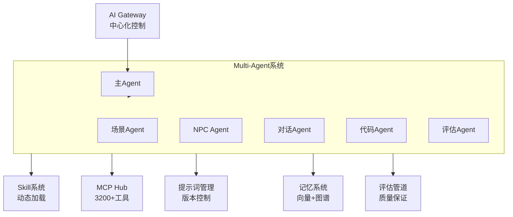

# Quest五层架构详解

> 从用户交互到底层渲染的完整技术栈

---

## 架构概览

```
┌──────────────────────────────────────────┐
│  第5层：用户交互层（编辑器）             │
│  Electron + React + Monaco               │
├──────────────────────────────────────────┤
│  第4层：AI智能层（Agent核心）            │
│  Multi-Agent + Skill + MCP + 评估管道    │
├──────────────────────────────────────────┤
│  第3层：语义抽象层（核心创新）           │
│  语义化API + 提示词资产系统              │
├──────────────────────────────────────────┤
│  第2层：引擎适配层                       │
│  Cocos 4 TypeScript适配器                │
├──────────────────────────────────────────┤
│  第1层：渲染运行时层                     │
│  Cocos 4 C++引擎（MIT）                  │
└──────────────────────────────────────────┘
```

---

## 第5层：用户交互层

**技术栈**: Electron + React + Monaco Editor

**核心组件**:
- AI对话界面（主交互方式）
- 场景实时预览（Cocos 4渲染）
- 资产预览器（纹理/模型/音频/字体）
- 代码编辑器（Monaco，可选）
- 项目管理器

**设计理念**: 
- 对话优先，手动编辑次要
- 轻量化，不需要复杂工具
- 实时预览，所见即所得

详见：[完整架构文档](complete.md#第5层用户交互层)

---

## 第4层：AI智能层

**技术栈**: Node.js + 自研Agent框架

**核心模块**:


**关键特性**:
- 动态工作流（运行时可修改）
- Skill热加载（Markdown格式）
- Agent间协作（黑板系统）
- 质量自动评估和优化

详见：[Agent系统文档](../02-agent-system/complete.md)

---

## 第3层：语义抽象层（核心创新）

**这是Quest最核心的创新层**

**设计理念**: 将底层技术细节抽象为AI可理解的语义概念

```typescript
// 传统API（技术细节）
const node = new cc.Node();
node.setPosition(100, 200, 0);
node.addComponent(cc.Sprite);
// AI难以理解意图

// 语义化API（概念描述）
const hero = quest.create({
  type: 'character',
  position: 'center',
});
// AI完全理解：创建角色在中心位置
```

**三大原则**:
1. 声明式 - What not How
2. 语义化 - Concept not Technical
3. 可组合 - Composable

**核心价值**:
- AI友好度：60% → 95%
- 代码量：减少98%
- 学习门槛：降低10倍

详见：[语义化API文档](../03-semantic-api/principles.md)

---

## 第2层：引擎适配层

**职责**: 将语义化API转换为Cocos 4原生调用

```typescript
// 语义 → 技术的转换
class Cocos4Adapter {
  async createNode(descriptor: GameObjectDescriptor): Promise<cc.Node> {
    // 1. 语义位置 → 具体坐标
    const pos = this.resolvePosition(descriptor.position);
    
    // 2. 语义行为 → 组件
    const components = this.resolveBehaviors(descriptor.behaviors);
    
    // 3. 组装Cocos 4对象
    const node = new cc.Node(descriptor.name);
    node.setPosition(pos);
    components.forEach(c => node.addComponent(c));
    
    return node;
  }
}
```

**改造范围**:
- ✅ 语义化GameObject API
- ✅ 语义化Scene API
- ✅ 语义化Behavior API
- ✅ 运行时独立模式
- ✅ 热更新支持

详见：[完整架构文档](complete.md#第2层引擎适配层)

---

## 第1层：渲染运行时层

**直接使用Cocos 4，不改造**

**Cocos 4提供的能力**:
- C++高性能渲染器
- 跨平台支持（Web/iOS/Android/Desktop）
- WebGL/Metal/Vulkan多后端
- 物理引擎（Box2D）
- 音频系统
- 动画系统
- 粒子系统

**为什么选择Cocos 4**:
- MIT协议，可改造
- 2D/3D都支持
- TypeScript脚本层
- 跨平台性能优秀

详见：[技术栈对比](tech-stack.md)

---

## 数据流向

```mermaid
graph TB
    user[用户对话<br/>"创建森林场景"]
    
    gateway[AI Gateway<br/>解析意图]
    
    master[主Agent<br/>任务分解]
    
    scene[场景Agent<br/>生成场景描述]
    
    eval[评估Agent<br/>质量检查]
    
    semantic[语义API<br/>转换为语义描述]
    
    adapter[适配器<br/>转换为Cocos调用]
    
    cocos[Cocos 4<br/>渲染场景]
    
    preview[预览窗口<br/>显示给用户]
    
    user --> gateway
    gateway --> master
    master --> scene
    scene --> eval
    eval -->|通过| semantic
    eval -->|失败| scene
    semantic --> adapter
    adapter --> cocos
    cocos --> preview
    preview -.反馈.-> user
```

---

## 跨层交互

### AI层 ↔ 语义层
```typescript
// Agent调用语义API
const scene = await semanticAPI.createScene({
  name: 'Forest',
  environment: { lighting: 'afternoon' },
});
```

### 语义层 ↔ 适配层
```typescript
// 语义API调用适配器
const node = await adapter.createNode({
  type: 'character',
  position: 'center',  // 语义描述
});
// 适配器转换为：
// new cc.Node().setPosition(screenWidth/2, screenHeight/2)
```

### 适配层 ↔ 运行时
```typescript
// 适配器调用Cocos 4原生API
const node = new cc.Node();
node.addComponent(cc.Sprite);
cc.director.getScene().addChild(node);
```

---

## 总结

Quest的五层架构实现了：
- ✅ 关注点分离（每层职责清晰）
- ✅ 技术栈统一（全TypeScript）
- ✅ 可扩展性强（各层独立演进）
- ✅ AI原生设计（第3-4层为AI优化）

**核心创新在第3层（语义抽象层）和第4层（AI智能层）**

---

更多详细设计见：[完整架构文档](complete.md)
