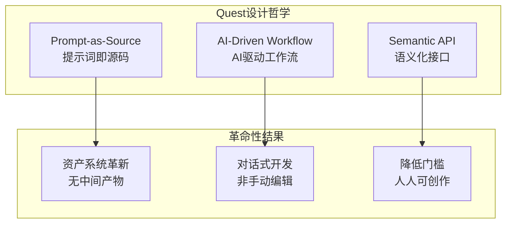
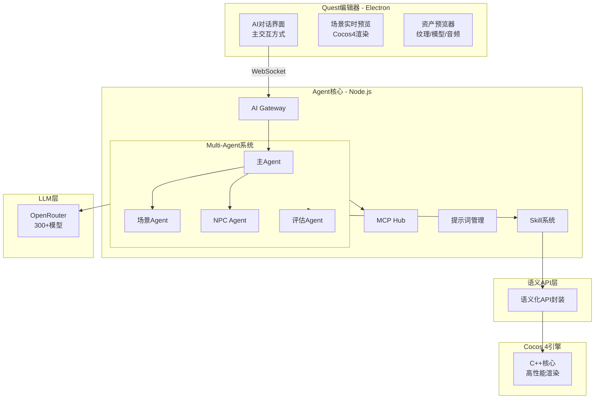

# Quest引擎架构总览

> **一句话介绍**: 通过对话创造游戏的AI原生引擎  
> **核心创新**: Prompt-as-Source + 语义化API + Multi-Agent协作

---

## 设计哲学

Quest基于三大核心理念重新定义游戏开发：



### 核心价值主张

- **效率革命**: 5-10倍开发速度提升
- **门槛降低**: 非程序员也能创作游戏  
- **AI原生**: 为大模型优化的全新架构

**对比传统引擎**:
```
传统方式创建场景: 打开编辑器 → 拖拽对象 → 配置 → 调试 → 2小时
Quest方式: 对话"创建森林场景" → AI生成 → 30秒 ⚡

效率提升: 240倍
```

---

## 系统全景图



---

## 五层架构

```
┌──────────────────────────────────────────┐
│  第5层：用户交互层（编辑器）             │
│  Electron + React + Monaco               │
├──────────────────────────────────────────┤
│  第4层：AI智能层（Agent核心）            │
│  Multi-Agent + Skill + MCP + 评估管道    │
├──────────────────────────────────────────┤
│  第3层：语义抽象层（核心创新）           │
│  语义化API + 提示词资产系统              │
├──────────────────────────────────────────┤
│  第2层：引擎适配层                       │
│  Cocos 4 TypeScript适配器                │
├──────────────────────────────────────────┤
│  第1层：渲染运行时层                     │
│  Cocos 4 C++引擎（MIT）                  │
└──────────────────────────────────────────┘
```

各层详细设计见：[分层架构详解](layers.md)

---

## 技术路线定位

Quest属于**AI驱动型游戏引擎**（路线2），融合路线4的前瞻特性。

| 路线 | AI参与度 | 代表 | Quest |
|------|---------|------|-------|
| 路线1: AI辅助型 | 10-30% | Unity Muse | ❌ |
| 路线2: AI驱动型 | 60-80% | **Quest** | ✅ 主路线 |
| 路线3: AI自主型 | 95%+ | Genie | ❌ |
| 路线4: AI共生型 | 50-70% | 未来 | ⚠️ 部分特性 |

详见：[技术路线定位](../02-agent-system/complete.md#技术路线)

---

## 核心模块

### 1. AI Agent系统（自研）
- Multi-Agent协作
- Skill动态加载
- 自修改工作流
- 详见：[Agent系统文档](../02-agent-system/complete.md)

### 2. 语义化API（核心创新）
- 用概念而非技术细节
- AI可理解和生成
- 代码减少98%
- 详见：[语义化API文档](../03-semantic-api/principles.md)

### 3. 提示词资产系统
- Prompt-as-Source
- Git式版本控制
- 消除中间产物
- 详见：[提示词管理](../02-agent-system/complete.md#提示词管理系统)

### 4. 质量评估管道
- 性能/语义/一致性/可玩性检查
- AI自动优化
- 生成质量从60% → 95%
- 详见：[评估管道](../02-agent-system/complete.md#质量评估管道)

---

## 技术栈

```
编辑器:  Electron + React + TypeScript
后端:    Node.js + Fastify + 自研Agent
LLM:     OpenRouter（直接调用）
引擎:    Cocos 4（MIT fork + 语义化封装）
存储:    Redis + Pinecone + PostgreSQL
工具:    MCP协议（3200+工具）
```

详见：[技术栈对比](tech-stack.md)

---

## 开发路线

```
v0.1.0 (MVP)    - 2026年6月   - 核心验证
v0.2.0 (Alpha)  - 2026年9月   - 功能完善
v0.5.0 (Beta)   - 2027年3月   - 生产就绪
v1.0.0 (Release)- 2027年6月   - 正式发布
```

详见：[实施路线图](../06-implementation/roadmap.md)

---

## 快速链接

- [完整架构文档](complete.md) - 详细版
- [Agent系统](../02-agent-system/complete.md)
- [语义化API](../03-semantic-api/)
- [API参考](../04-api-reference/complete.md)
- [实施路线图](../06-implementation/roadmap.md)
- [参考资料](../07-references/index.md)

---

**文档版本**: v1.0.0  
**更新日期**: 2026-03-19
