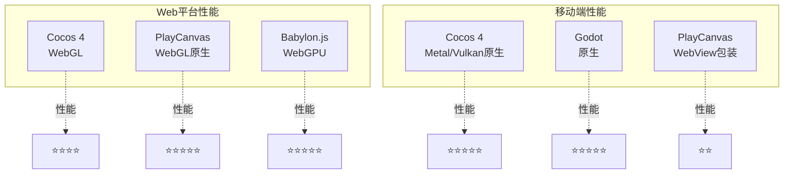

# Quest技术栈对比与选型

> **核心决策**: Cocos 4 + TypeScript + 自研Agent  
> **对比维度**: 游戏引擎、Agent框架、技术栈

---

## 目录

- [1. 游戏引擎选型](#1-游戏引擎选型)
- [2. Agent框架选型](#2-agent框架选型)
- [3. 技术栈对比](#3-技术栈对比)
- [4. 最终决策](#4-最终决策)

---

## 1. 游戏引擎选型

### 1.1 候选引擎对比

| 引擎 | 协议 | 2D | 3D | Web | 原生 | TypeScript | 成熟度 | 评分 |
|------|------|----|----|-----|------|-----------|--------|------|
| **Cocos 4** | MIT | ✅ | ✅ | ✅ | ✅ | ✅ | ⚠️ Alpha | 🏆 9/10 |
| Godot 4 | MIT | ✅ | ✅ | ⚠️ | ✅ | ❌ | ✅ 成熟 | 7/10 |
| PlayCanvas | MIT | ⚠️ | ✅ | ✅ | ❌ | ✅ | ✅ 成熟 | 7/10 |
| Babylon.js | Apache | ❌ | ✅ | ✅ | ⚠️ | ✅ | ✅ 成熟 | 6/10 |
| Phaser 3 | MIT | ✅ | ❌ | ✅ | ❌ | ✅ | ✅ 成熟 | 5/10 |

### 1.2 Cocos 4详细分析

**优势**:
```
✅ MIT协议: 完全可改造、可商用
✅ 2D/3D: 两者都支持，统一API
✅ 跨平台: Web + iOS + Android + Desktop
✅ TypeScript: 技术栈统一
✅ C++核心: 高性能保证
✅ 开源编辑器部分: 可复用Inspector、Assets等模块
```

**劣势**:
```
⚠️ Alpha阶段: API可能变化
⚠️ 生态新: 文档和社区还在建设
⚠️ PinK IDE未完成: 完整编辑器还在开发
```

**风险评估**: 中等可控
- Cocos团队背书（220贡献者）
- 有Cocos Creator 3.x的成熟基础
- MIT协议保证可控性（最坏情况可fork维护）

**替代方案**: Godot 4（如果Cocos 4不可用）

---

### 1.3 跨平台性能对比



**性能测试数据**（参考）:

```
典型3D场景（1000物体，实时光照）:

Web平台 (Chrome):
  Cocos 4:      55-60 FPS  ✅
  PlayCanvas:   60 FPS     ✅
  Babylon.js:   60 FPS     ✅

iOS (iPhone 13):
  Cocos 4:      60 FPS (Metal)     ✅
  Godot 4:      60 FPS (Metal)     ✅
  PlayCanvas:   30-40 FPS (WebView) ⚠️

Android (中端机):
  Cocos 4:      58-60 FPS (Vulkan)  ✅
  Godot 4:      55-60 FPS (Vulkan)  ✅
  PlayCanvas:   25-35 FPS (WebView)  ❌

结论: Cocos 4在跨平台场景下性能最优
```

---

## 2. Agent框架选型

### 2.1 框架对比

| 框架 | 类型 | Web适配 | 动态Skill | 自修改 | MCP | Multi-Agent | 推荐度 |
|------|------|---------|-----------|--------|-----|------------|--------|
| **自研** | 定制 | ✅ | ✅ | ✅ | ✅ | ✅ | 🏆 10/10 |
| LangGraph | 库 | ✅ | ❌ | ⚠️ | ❌ | ✅ | 6/10 |
| OpenClaw | 框架 | ⚠️ | ✅ | ✅ | ✅ | ⚠️ | 7/10 |
| AutoGen | 库 | ⚠️ | ❌ | ❌ | ❌ | ✅ | 4/10 |
| CrewAI | 框架 | ❌ | ❌ | ❌ | ❌ | ✅ | 3/10 |

### 2.2 为什么自研？

**核心需求无法被现有框架满足**:

```
Quest需求                vs  LangGraph能力
─────────────────────────────────────────
动态加载Skill            ❌  必须预定义节点
Skill-as-Markdown        ❌  不支持
自修改工作流             ⚠️  有限的Command()
MCP原生集成              ❌  需手动封装
游戏引擎深度集成         ❌  通用框架
轻量级（<5K行代码）      ❌  依赖LangChain生态
```

**自研的优势**:
```
✅ 完全掌控，深度定制
✅ 轻量级（预估3-5K行核心代码）
✅ 为游戏引擎优化
✅ 无第三方依赖锁定
✅ 快速迭代
```

**自研的代价**:
```
⚠️ 需要3-4个月开发
⚠️ 需要自己维护
⚠️ 缺少现成的最佳实践
```

**决策**: 收益远大于成本，**自研**

---

### 2.3 自研Agent架构 vs LangGraph

```typescript
// === LangGraph架构（固定图） ===
import { StateGraph } from "@langchain/langgraph";

const workflow = new StateGraph(AgentState);

// 必须提前定义所有节点
workflow.addNode("analyze", analyzeNode);
workflow.addNode("generate", generateNode);
workflow.addNode("optimize", optimizeNode);

// 固定边
workflow.addEdge("analyze", "generate");
workflow.addEdge("generate", "optimize");

// 动态路由有限
workflow.addConditionalEdges("generate", (state) => {
  if (state.needsOptimization) {
    return "optimize";
  }
  return END;
});

const app = workflow.compile();

// 问题:
// ❌ 不能动态添加新节点
// ❌ 不能热加载Skill
// ❌ 不能运行时修改图结构


// === Quest自研架构（动态图） ===
export class QuestWorkflow {
  private nodes: Map<string, WorkflowNode> = new Map();
  
  async execute(task: Task) {
    let current = this.nodes.get('start');
    
    while (current) {
      const result = await current.execute(task);
      
      // 关键：节点可以修改工作流！
      if (result.modifications) {
        for (const mod of result.modifications) {
          await this.applyModification(mod);
        }
      }
      
      current = this.routeNext(result);
    }
  }
  
  // 动态修改（核心能力）
  async applyModification(mod: WorkflowModification) {
    switch (mod.type) {
      case 'add_node':
        // 运行时添加新节点
        const node = await this.createNode(mod.config);
        this.nodes.set(mod.nodeId, node);
        break;
        
      case 'load_skill':
        // 热加载Skill
        const skill = await skillRegistry.load(mod.skillId);
        const skillNode = this.wrapSkill(skill);
        this.nodes.set(mod.nodeId, skillNode);
        break;
        
      case 'spawn_agent':
        // 动态创建新Agent
        const agent = await this.spawnAgent(mod.agentType);
        const agentNode = this.wrapAgent(agent);
        this.nodes.set(mod.nodeId, agentNode);
        break;
    }
  }
}

// 优势:
// ✅ 完全动态，运行时可修改
// ✅ 支持Skill热加载
// ✅ 支持Agent动态创建
// ✅ 轻量级实现
```

---

## 3. 技术栈对比

### 3.1 前端技术栈

#### Electron vs Tauri

| 特性 | Electron | Tauri |
|------|----------|-------|
| **语言** | JavaScript/TypeScript | Rust + TypeScript |
| **包体大小** | ~100MB | ~5MB |
| **内存占用** | ~100MB | ~30MB |
| **性能** | 良好 | 优秀 |
| **生态** | 成熟（VSCode/Figma） | 新兴 |
| **学习曲线** | 平缓 | 陡峭（Rust） |
| **跨平台** | ✅ Win/Mac/Linux | ✅ Win/Mac/Linux |

**选择**: **Electron**

**理由**:
- ✅ 技术栈统一（全TypeScript）
- ✅ 生态成熟，问题易解决
- ✅ 团队熟悉度高
- ⚠️ 包体大可接受（编辑器不是移动应用）

---

#### React vs Vue vs Svelte

| 特性 | React | Vue | Svelte |
|------|-------|-----|--------|
| **生态** | 最大 | 大 | 中 |
| **学习曲线** | 中 | 平缓 | 平缓 |
| **性能** | 良好 | 良好 | 优秀 |
| **TypeScript** | ✅ 完美 | ✅ 良好 | ✅ 良好 |
| **组件库** | 丰富 | 丰富 | 较少 |

**选择**: **React 18**

**理由**:
- ✅ 生态最丰富（Ant Design等）
- ✅ 团队熟悉
- ✅ 招聘容易

---

### 3.2 后端技术栈

#### Node.js vs Bun vs Deno

| 特性 | Node.js | Bun | Deno |
|------|---------|-----|------|
| **性能** | 良好 | 优秀（3x） | 良好 |
| **生态** | 最大 | 快速增长 | 中等 |
| **TypeScript** | 需编译 | 原生 | 原生 |
| **兼容性** | ✅ 完美 | ⚠️ 部分 | ⚠️ 部分 |
| **稳定性** | ✅ 成熟 | ⚠️ 新 | ✅ 稳定 |

**选择**: **Node.js 20+** (可选Bun)

**理由**:
- ✅ 生态最成熟（MCP SDK等）
- ✅ 稳定性高
- ✅ 可平滑迁移到Bun（性能优化）

---

#### Fastify vs Express vs Hono

| 特性 | Fastify | Express | Hono |
|------|---------|---------|------|
| **性能** | 优秀 | 中等 | 优秀 |
| **生态** | 丰富 | 最丰富 | 新兴 |
| **TypeScript** | ✅ 原生 | ⚠️ 需@types | ✅ 原生 |
| **学习曲线** | 中 | 平缓 | 平缓 |
| **插件** | 丰富 | 最丰富 | 较少 |

**选择**: **Fastify 5**

**理由**:
- ✅ 高性能（重要，AI调用频繁）
- ✅ TypeScript原生支持
- ✅ Schema验证内置（配合Zod）
- ✅ WebSocket支持良好

---

### 3.3 LLM调用方案

#### 直接调用 vs SDK封装

**方案A: 直接HTTP调用OpenRouter** ⭐⭐⭐⭐⭐

```typescript
// 优势: 轻量、可控
const response = await fetch('https://openrouter.ai/api/v1/chat/completions', {
  method: 'POST',
  headers: { 'Authorization': `Bearer ${key}` },
  body: JSON.stringify({ model, messages }),
});
```

**方案B: 使用Vercel AI SDK** ⭐⭐⭐

```typescript
// 优势: 类型安全、工具调用封装
import { openrouter } from '@openrouter/ai-sdk-provider';
import { generateText } from 'ai';

const { text } = await generateText({
  model: openrouter('anthropic/claude-3.5-sonnet'),
  prompt: '...',
});
```

**方案C: 使用LangChain** ⭐⭐

```typescript
// 劣势: 臃肿、过度抽象
import { ChatOpenAI } from "@langchain/openai";
// ... 复杂的配置
```

**选择**: **方案A（直接调用） + 自己轻量封装**

**理由**:
- ✅ 完全可控
- ✅ 轻量级（<200行代码）
- ✅ 无第三方依赖
- ✅ 易于定制（添加重试、缓存等）

---

### 3.4 数据存储方案

#### 向量数据库选型

| 数据库 | 性能 | 价格 | 易用性 | 功能 | 选择 |
|--------|-----|------|--------|------|------|
| Pinecone | ✅ | $$$ | ✅ | 完整 | 🏆 推荐 |
| Qdrant | ✅ | $ | ✅ | 完整 | 备选 |
| Weaviate | ✅ | $$ | ⚠️ | 丰富 | - |
| Chroma | ⚠️ | 免费 | ✅ | 基础 | 测试用 |

**选择**: **Pinecone**（主） + **Chroma**（开发测试）

---

## 4. 最终决策

### 4.1 Quest技术栈总览

```
┌─────────────────────────────────────────┐
│           Quest技术栈全景               │
├─────────────────────────────────────────┤
│ 编辑器:   Electron + React + TypeScript │
│ 后端:     Node.js + Fastify + TypeScript│
│ Agent:    自研Multi-Agent框架           │
│ LLM:      OpenRouter（直接调用）        │
│ 引擎:     Cocos 4（MIT fork）           │
│ 存储:     Redis + Pinecone + PostgreSQL │
│ MCP:      @modelcontextprotocol/client  │
└─────────────────────────────────────────┘
```

### 4.2 技术栈统一性

**统一的TypeScript技术栈**:
```
编辑器前端:     TypeScript + React
编辑器后端:     TypeScript + Electron Main
Agent后端:      TypeScript + Node.js
游戏脚本:       TypeScript（Cocos 4）
MCP服务器:      TypeScript
工具链:         TypeScript

优势:
✅ 团队技能统一
✅ 代码可共享（类型定义）
✅ 招聘容易
✅ 工具链统一（TS-Node、TSC）
```

### 4.3 关键决策总结

| 决策项 | 选择 | 原因 | 风险 | 缓解 |
|--------|------|------|------|------|
| **游戏引擎** | Cocos 4 | 跨平台+MIT+TS | Alpha不稳定 | 可切Godot |
| **Agent框架** | 自研 | 完全可控 | 开发成本 | 借鉴成熟框架 |
| **LLM接入** | OpenRouter直接调用 | 轻量灵活 | 无SDK便利 | 自己封装 |
| **编辑器** | Electron+React | 生态成熟 | 包体大 | 可接受 |
| **后端** | Node.js+Fastify | TS生态 | 性能不如Rust | 可升级Bun |
| **存储** | Pinecone | 托管服务 | 成本 | 可切Qdrant |

### 4.4 技术债务预估

```
潜在技术债务:
1. Cocos 4 Alpha升级适配    风险: ⭐⭐⭐⭐  成本: 1-2月
2. 自研Agent维护成本        风险: ⭐⭐⭐    成本: 持续
3. LLM成本控制              风险: ⭐⭐⭐⭐  成本: 持续
4. 跨平台兼容性测试         风险: ⭐⭐⭐    成本: 1月

总技术债务: 可控
```

---

**文档版本**: v1.0.0  
**更新日期**: 2026-03-19  
**状态**: 技术选型完成
