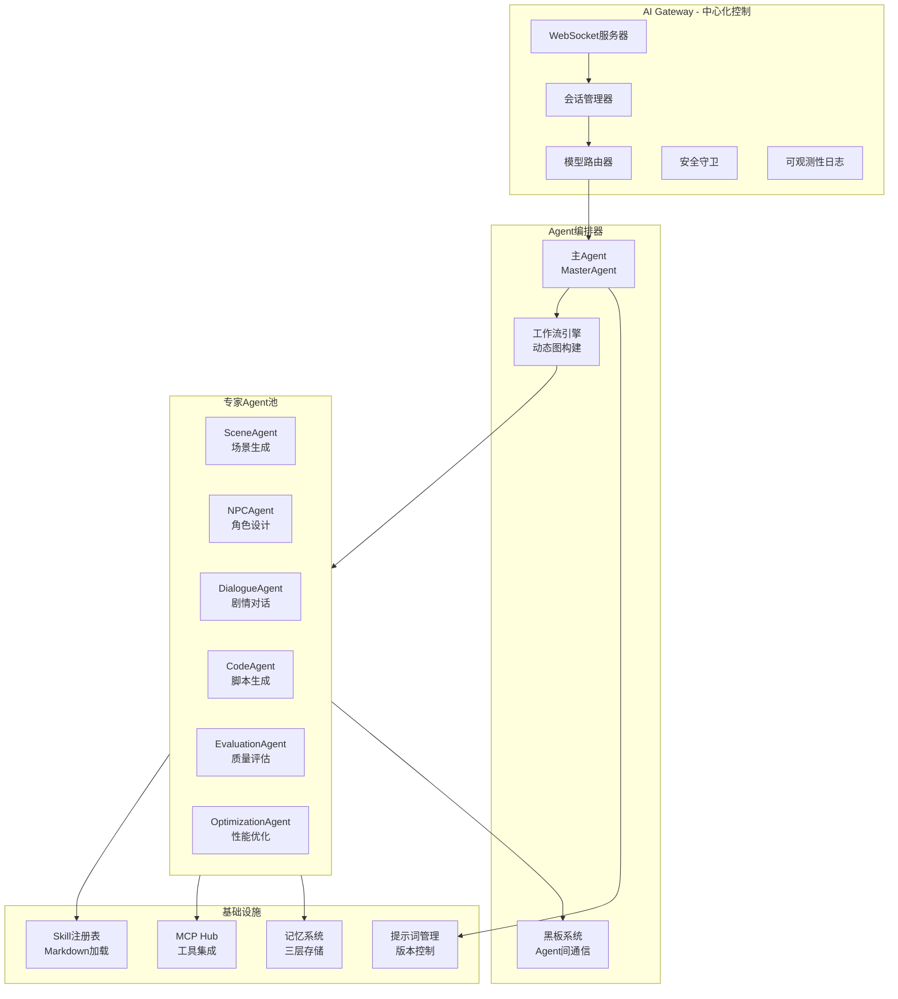
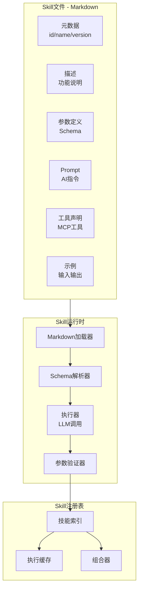

# Quest Agent系统详细设计

> **核心理念**: 自研Multi-Agent系统，基于OpenRouter + MCP + Skill动态加载  
> **参考架构**: OpenClaw Gateway模式 + 自修改工作流  
> **技术栈**: TypeScript + Node.js

---

## 目录

- [1. Agent系统架构](#1-agent系统架构)
- [2. 核心Agent详解](#2-核心agent详解)
- [3. Skill系统设计](#3-skill系统设计)
- [4. MCP集成方案](#4-mcp集成方案)
- [5. OpenRouter集成](#5-openrouter集成)
- [6. 自修改工作流](#6-自修改工作流)
- [7. 实现示例](#7-实现示例)

---

## 1. Agent系统架构

### 1.1 整体架构



### 1.2 核心类设计

```typescript
// src/agent-core/base-agent.ts

export abstract class BaseAgent {
  protected llm: OpenRouterClient;
  protected memory: MemorySystem;
  protected mcpHub: MCPHub;
  protected skillRegistry: SkillRegistry;
  
  constructor(config: AgentConfig) {
    this.llm = new OpenRouterClient(config.apiKey);
    this.memory = config.memory;
    this.mcpHub = config.mcpHub;
    this.skillRegistry = config.skillRegistry;
  }
  
  // 核心执行方法（子类实现）
  abstract async execute(task: Task, context: Context): Promise<AgentResult>;
  
  // Think - 推理
  protected async think(input: string): Promise<Reasoning> {
    const result = await this.llm.call({
      model: 'anthropic/claude-3.5-sonnet',
      systemPrompt: this.getSystemPrompt(),
      userInput: input,
      temperature: 0.7,
    });
    
    return this.parseReasoning(result);
  }
  
  // Act - 执行动作
  protected async act(action: Action): Promise<ActionResult> {
    // 调用MCP工具执行实际操作
    const tool = await this.mcpHub.getTool(action.toolName);
    return await tool.call(action.parameters);
  }
  
  // Observe - 观察结果
  protected async observe(result: ActionResult): Promise<Observation> {
    // 评估执行结果
    return {
      success: result.error ? false : true,
      data: result.data,
      feedback: await this.generateFeedback(result),
    };
  }
  
  // 获取系统提示词（子类覆盖）
  protected abstract getSystemPrompt(): string;
}
```

---

## 2. 核心Agent详解

### 2.1 MasterAgent（主Agent）

**职责**: 任务分解、Agent调度、结果整合

```typescript
// src/agent-core/agents/master-agent.ts

export class MasterAgent extends BaseAgent {
  protected getSystemPrompt(): string {
    return `你是Quest游戏引擎的主Agent，负责：
1. 理解用户的游戏开发需求
2. 将复杂任务分解为子任务
3. 调度专家Agent执行
4. 整合所有结果并返回

你可以调用的专家Agent：
- SceneAgent: 生成游戏场景
- NPCAgent: 设计NPC角色和行为
- DialogueAgent: 生成对话和剧情
- CodeAgent: 编写游戏脚本
- EvaluationAgent: 评估生成质量

请用JSON格式返回任务分解计划。`;
  }
  
  async execute(task: Task, context: Context): Promise<AgentResult> {
    // 1. 分析任务
    const analysis = await this.analyzeTask(task);
    
    // 2. 分解为子任务
    const subtasks = await this.decomposeTask(analysis);
    
    // 3. 并行执行子任务
    const results = await Promise.all(
      subtasks.map(subtask => this.delegateToExpert(subtask))
    );
    
    // 4. 整合结果
    const integrated = await this.integrateResults(results);
    
    // 5. 质量评估
    const evaluated = await this.evaluateResult(integrated);
    
    return evaluated;
  }
  
  private async analyzeTask(task: Task): Promise<TaskAnalysis> {
    const result = await this.think(`分析以下游戏开发任务：
      任务描述: ${task.description}
      用户意图: ${task.userIntent}
      
      请分析：
      1. 任务类型（场景创建/NPC设计/剧情编写/代码实现）
      2. 复杂度（simple/medium/complex）
      3. 需要的专家Agent
      4. 预估工作量
    `);
    
    return this.parseAnalysis(result);
  }
  
  private async decomposeTask(analysis: TaskAnalysis): Promise<SubTask[]> {
    const result = await this.think(`将任务分解为可并行的子任务：
      任务类型: ${analysis.type}
      复杂度: ${analysis.complexity}
      
      返回JSON格式的子任务列表。
    `);
    
    return JSON.parse(result.content);
  }
  
  private async delegateToExpert(subtask: SubTask): Promise<SubTaskResult> {
    // 选择专家Agent
    const agent = this.selectExpertAgent(subtask.type);
    
    // 执行
    const result = await agent.execute(subtask, {
      memory: this.memory,
      mcpHub: this.mcpHub,
      skillRegistry: this.skillRegistry,
    });
    
    return result;
  }
}
```

---

### 2.2 SceneAgent（场景Agent）

**职责**: 生成游戏场景、关卡、环境

```typescript
// src/agent-core/agents/scene-agent.ts

export class SceneAgent extends BaseAgent {
  protected getSystemPrompt(): string {
    return `你是Quest的场景生成专家，精通：
1. 关卡设计和布局
2. 环境氛围营造
3. 光照和特效配置
4. 性能优化

你可以使用的Skill：
- terrain-generator: 地形生成
- lighting-designer: 光照设计
- prop-placer: 道具摆放
- atmosphere-creator: 氛围营造

返回符合Quest语义化API的场景描述JSON。`;
  }
  
  async execute(task: Task, context: Context): Promise<SceneResult> {
    // 1. 加载场景生成Skill
    const skills = await context.skillRegistry.loadSkills([
      'terrain-generator',
      'lighting-designer',
      'prop-placer',
    ]);
    
    // 2. 生成场景描述
    const sceneDesc = await this.generateSceneDescription(task, skills);
    
    // 3. 调用语义API创建场景
    const scene = await this.createSceneFromDescription(sceneDesc);
    
    // 4. 优化性能
    const optimized = await this.optimizeScene(scene);
    
    return {
      scene: optimized,
      descriptor: sceneDesc,
      metadata: {
        triangles: optimized.totalTriangles,
        textureSize: optimized.totalTextureSize,
        drawCalls: optimized.estimatedDrawCalls,
      },
    };
  }
  
  private async generateSceneDescription(
    task: Task,
    skills: Skill[]
  ): Promise<SceneDescriptor> {
    // 组合多个Skill的Prompt
    const combinedPrompt = skills.map(s => s.prompt).join('\n\n');
    
    // 调用LLM生成
    const result = await this.llm.call({
      model: 'anthropic/claude-3.5-sonnet',
      systemPrompt: combinedPrompt,
      userInput: task.description,
      tools: this.mcpHub.getTools(['cocos4', 'asset-generation']),
      responseFormat: { type: 'json_object' },
    });
    
    return JSON.parse(result.content);
  }
  
  private async createSceneFromDescription(
    desc: SceneDescriptor
  ): Promise<Scene> {
    // 调用Quest语义化API
    return await quest.createScene({
      name: desc.name,
      environment: {
        lighting: desc.lighting,
        skybox: desc.skybox,
        ambientSound: desc.ambientSound,
      },
      terrain: desc.terrain,
      objects: desc.objects,
    });
  }
}
```

---

### 2.3 NPCAgent（NPC Agent）

**职责**: 设计NPC角色、行为、对话

```typescript
// src/agent-core/agents/npc-agent.ts

export class NPCAgent extends BaseAgent {
  protected getSystemPrompt(): string {
    return `你是Quest的NPC设计专家，精通：
1. 角色设计（外观、性格、背景）
2. 行为设计（AI、状态机、行为树）
3. 对话系统（对话树、情感系统）
4. 游戏平衡性

使用Quest的语义化API设计NPC。`;
  }
  
  async execute(task: Task, context: Context): Promise<NPCResult> {
    // 1. 设计角色概念
    const concept = await this.designCharacterConcept(task);
    
    // 2. 生成外观资产
    const appearance = await this.generateAppearance(concept);
    
    // 3. 设计行为系统
    const behavior = await this.designBehavior(concept);
    
    // 4. 创建对话系统（如果需要）
    const dialogue = concept.isInteractive
      ? await this.createDialogue(concept)
      : null;
    
    // 5. 生成完整NPC
    const npc = await quest.create({
      type: 'npc',
      name: concept.name,
      appearance: appearance,
      behavior: behavior,
      dialogue: dialogue,
      attributes: concept.attributes,
    });
    
    return { npc, concept, metadata: {} };
  }
  
  private async designBehavior(concept: CharacterConcept): Promise<BehaviorDescriptor> {
    // 加载行为设计Skill
    const skill = await this.skillRegistry.loadSkill('npc-behavior-designer');
    
    // 执行Skill
    const result = await skill.execute({
      npcType: concept.type,
      personality: concept.personality,
      behaviors: concept.requiredBehaviors,
    }, {
      llm: this.llm,
      mcpTools: this.mcpHub.getTools(['behavior-tree', 'state-machine']),
    });
    
    return result.behaviorDescriptor;
  }
}
```

---

### 2.4 EvaluationAgent（评估Agent）

**职责**: 质量评估、问题发现、优化建议

```typescript
// src/agent-core/agents/evaluation-agent.ts

export class EvaluationAgent extends BaseAgent {
  protected getSystemPrompt(): string {
    return `你是Quest的质量评估专家，负责：
1. 评估AI生成内容的质量
2. 发现性能问题、语义问题、一致性问题
3. 提供优化建议
4. 决定是否需要重新生成

你的评估标准：
- 性能: 多边形<50K，纹理<10MB，DrawCall<100
- 语义: 是否符合原始需求
- 一致性: 是否与项目风格匹配
- 可玩性: 是否有明显bug

返回评估报告JSON。`;
  }
  
  async execute(task: Task, context: Context): Promise<EvaluationResult> {
    const asset = task.assetToEvaluate;
    
    // 1. 性能检查
    const perfCheck = await this.performanceCheck(asset);
    
    // 2. 语义验证（使用LLM）
    const semanticCheck = await this.semanticValidation(asset, task.originalPrompt);
    
    // 3. 一致性检查
    const consistencyCheck = await this.consistencyCheck(asset, context.projectStyle);
    
    // 4. 可玩性测试
    const playabilityCheck = await this.playabilityTest(asset);
    
    // 5. 汇总评估
    const overallScore = this.aggregateScore([
      perfCheck,
      semanticCheck,
      consistencyCheck,
      playabilityCheck,
    ]);
    
    return {
      passed: overallScore >= 0.8,
      score: overallScore,
      checks: {
        performance: perfCheck,
        semantic: semanticCheck,
        consistency: consistencyCheck,
        playability: playabilityCheck,
      },
      suggestions: await this.generateSuggestions([
        perfCheck,
        semanticCheck,
        consistencyCheck,
        playabilityCheck,
      ]),
    };
  }
  
  // 语义验证（LLM评估）
  private async semanticValidation(
    asset: GeneratedAsset,
    originalPrompt: string
  ): Promise<CheckResult> {
    const result = await this.llm.call({
      model: 'anthropic/claude-3.5-sonnet',
      systemPrompt: `你是质量评估专家，请验证生成的资产是否符合原始需求。`,
      userInput: `
原始需求: ${originalPrompt}
生成结果: ${JSON.stringify(asset.result, null, 2)}

请评估：
1. 是否符合原始需求？（0-1分）
2. 是否有逻辑矛盾？
3. 风格是否一致？
4. 有哪些改进建议？

返回JSON格式的评估报告。
      `,
      responseFormat: { type: 'json_object' },
    });
    
    const evaluation = JSON.parse(result.content);
    
    return {
      category: 'semantic',
      score: evaluation.score,
      issues: evaluation.issues || [],
      suggestions: evaluation.suggestions || [],
    };
  }
}
```

---

## 3. Skill系统设计

### 3.1 Skill架构



### 3.2 Skill Markdown完整规范

```markdown
---
id: character-appearance-generator
name: 角色外观生成器
category: asset-generation
version: 1.3.0
author: Quest Team
tags: [character, art, generation]
model: anthropic/claude-3.5-sonnet
temperature: 0.8
tools:
  - generate_texture
  - create_sprite
  - apply_shader
dependencies:
  - basic-art-principles
requiredSkills: []
---

# 角色外观生成器

## 描述
根据文字描述生成角色的完整外观，包括精灵图、纹理、材质等。

## 功能
- 从文字描述生成2D精灵或3D模型外观
- 自动生成配套的纹理和材质
- 支持不同艺术风格（像素、卡通、写实等）
- 自动优化性能（纹理压缩、LOD等）

## 参数

### 输入参数Schema
```json
{
  "type": "object",
  "properties": {
    "description": {
      "type": "string",
      "description": "角色外观的文字描述",
      "example": "中世纪骑士，穿着银色盔甲，手持长剑"
    },
    "style": {
      "type": "string",
      "enum": ["pixel", "cartoon", "realistic", "low-poly"],
      "description": "艺术风格"
    },
    "dimensions": {
      "type": "string",
      "enum": ["2d", "3d"],
      "description": "2D精灵或3D模型"
    },
    "resolution": {
      "type": "string",
      "enum": ["low", "medium", "high"],
      "description": "分辨率/细节程度"
    }
  },
  "required": ["description", "style", "dimensions"]
}
```

### 输出Schema
```json
{
  "type": "object",
  "properties": {
    "assetId": { "type": "string" },
    "assetType": { "type": "string" },
    "assetUrl": { "type": "string" },
    "metadata": {
      "type": "object",
      "properties": {
        "width": { "type": "number" },
        "height": { "type": "number" },
        "format": { "type": "string" },
        "size": { "type": "number" }
      }
    }
  }
}
```

## Prompt

你是一个专业的游戏美术设计师，精通角色外观设计。

### 任务
根据以下描述生成角色外观：

**描述**: {description}
**艺术风格**: {style}
**维度**: {dimensions}
**分辨率**: {resolution}

### 生成步骤

1. **概念设计**
   - 分析描述，提取关键视觉元素
   - 确定色彩方案
   - 设计角色轮廓和比例

2. **资产生成**
   - 使用`generate_texture`工具生成纹理
   - 使用`create_sprite`工具创建精灵（2D）或模型（3D）
   - 使用`apply_shader`工具应用材质

3. **优化**
   - 检查纹理大小（建议<1MB）
   - 如果是3D，检查多边形数（建议<5000）
   - 自动压缩和优化

4. **返回结果**
   - 返回资产ID和URL
   - 提供完整的元数据
   - 包含优化建议

### 约束条件
- 2D精灵: 推荐512x512或1024x1024
- 3D模型: 多边形<5000（低模风格）
- 纹理格式: PNG（编辑） / Compressed（运行时）
- 确保符合项目整体风格

### MCP工具使用

**generate_texture**:
```json
{
  "prompt": "详细的纹理描述",
  "size": 1024,
  "style": "pixel|cartoon|realistic",
  "format": "png"
}
```

**create_sprite**:
```json
{
  "textureId": "生成的纹理ID",
  "pivot": [0.5, 0.5],
  "scale": 1.0
}
```

## 示例

### 示例1: 2D像素骑士

**输入**:
```json
{
  "description": "中世纪骑士，银色盔甲，红色披风",
  "style": "pixel",
  "dimensions": "2d",
  "resolution": "medium"
}
```

**输出**:
```json
{
  "assetId": "char_knight_001",
  "assetType": "sprite",
  "assetUrl": "assets://sprites/knight_001.png",
  "metadata": {
    "width": 64,
    "height": 64,
    "format": "PNG",
    "size": 8192,
    "animations": ["idle", "walk", "attack"]
  },
  "optimizations": [
    "已压缩至8KB",
    "已生成动画帧"
  ]
}
```

### 示例2: 3D低模法师

**输入**:
```json
{
  "description": "老年法师，紫色长袍，拿着法杖",
  "style": "low-poly",
  "dimensions": "3d",
  "resolution": "low"
}
```

**输出**:
```json
{
  "assetId": "char_wizard_001",
  "assetType": "model",
  "assetUrl": "assets://models/wizard_001.gltf",
  "metadata": {
    "triangles": 3200,
    "vertices": 1800,
    "textures": 1,
    "textureSize": 512,
    "format": "GLTF",
    "size": 245000,
    "bones": 0
  },
  "optimizations": [
    "多边形优化至3.2K",
    "纹理压缩为512x512",
    "已生成Draco压缩"
  ]
}
```

## 版本历史

- v1.0.0 (2026-01-15): 初始版本，支持2D精灵生成
- v1.1.0 (2026-02-01): 添加3D模型支持
- v1.2.0 (2026-02-20): 添加自动优化功能
- v1.3.0 (2026-03-10): 支持动画生成

## 依赖技能

- basic-art-principles: 基础美术原则（色彩、构图）

## 许可证

MIT License
```

---

### 3.3 Skill组合机制

```typescript
// src/skill-system/skill-composer.ts

export class SkillComposer {
  // 串行组合（Pipeline）
  composePipeline(skills: Skill[]): Skill {
    return {
      id: `pipeline_${skills.map(s => s.id).join('_')}`,
      name: `流水线: ${skills.map(s => s.name).join(' → ')}`,
      execute: async (input, context) => {
        let result = input;
        
        for (const skill of skills) {
          result = await skill.execute(result, context);
        }
        
        return result;
      },
    };
  }
  
  // 并行组合（Parallel）
  composeParallel(skills: Skill[]): Skill {
    return {
      id: `parallel_${skills.map(s => s.id).join('_')}`,
      name: `并行: ${skills.map(s => s.name).join(' + ')}`,
      execute: async (input, context) => {
        const results = await Promise.all(
          skills.map(skill => skill.execute(input, context))
        );
        
        // 合并结果
        return Object.assign({}, ...results);
      },
    };
  }
  
  // 条件组合（Conditional）
  composeConditional(
    condition: (input: any) => boolean,
    ifSkill: Skill,
    elseSkill: Skill
  ): Skill {
    return {
      id: `conditional_${ifSkill.id}_${elseSkill.id}`,
      name: `条件: ${ifSkill.name} 或 ${elseSkill.name}`,
      execute: async (input, context) => {
        const skill = condition(input) ? ifSkill : elseSkill;
        return await skill.execute(input, context);
      },
    };
  }
}

// 使用示例
const complexCharacterSkill = composer.composePipeline([
  skillRegistry.get('character-concept-designer'),   // 1. 设计概念
  skillRegistry.get('character-appearance-generator'), // 2. 生成外观
  skillRegistry.get('character-behavior-designer'),   // 3. 设计行为
  skillRegistry.get('character-optimizer'),          // 4. 优化
]);

const result = await complexCharacterSkill.execute({
  description: '一个会魔法的精灵射手',
  difficulty: 'hard',
}, context);
```

---

## 4. MCP集成方案

### 4.1 MCP Hub实现

```typescript
// src/mcp-hub/mcp-hub-impl.ts

export class MCPHubImpl implements MCPHub {
  private connections: Map<string, MCPConnection> = new Map();
  
  // 初始化预置MCP服务器
  async initialize(): Promise<void> {
    // 1. 游戏引擎工具
    await this.connectCocos4MCP();
    
    // 2. 文件系统
    await this.connectFileSystem();
    
    // 3. Git版本控制
    await this.connectGit();
    
    // 4. 浏览器自动化（测试用）
    await this.connectBrowser();
    
    // 5. 图像生成
    await this.connectImageGeneration();
  }
  
  private async connectCocos4MCP(): Promise<void> {
    await this.connect({
      id: 'cocos4',
      name: 'Cocos 4 Engine Tools',
      transport: {
        type: 'stdio',
        command: 'quest-cocos4-mcp-server',
        args: [],
      },
      tools: [
        'create_node',
        'modify_node',
        'delete_node',
        'add_component',
        'create_scene',
        'load_asset',
        'play_animation',
      ],
    });
  }
  
  // 动态安装ClawHub上的Skill
  async installFromClawHub(skillName: string): Promise<void> {
    // 1. 从ClawHub获取Skill配置
    const config = await fetch(
      `https://clawhub.com/api/skills/${skillName}`
    ).then(r => r.json());
    
    // 2. 下载MCP服务器
    await this.downloadMCPServer(config.serverUrl);
    
    // 3. 连接服务器
    await this.connect(config);
    
    // 4. 注册到Skill Registry
    await this.skillRegistry.registerMCPSkill(skillName, config);
  }
  
  // 工具调用（供Agent使用）
  async callTool(
    toolName: string,
    parameters: any
  ): Promise<ToolResult> {
    const [serverId, tool] = this.resolveTool(toolName);
    const connection = this.connections.get(serverId);
    
    if (!connection) {
      throw new Error(`MCP服务器未连接: ${serverId}`);
    }
    
    // 调用MCP工具
    const result = await connection.client.callTool({
      name: tool,
      arguments: parameters,
    });
    
    return result;
  }
}
```

### 4.2 自定义Cocos 4 MCP服务器

```typescript
// packages/quest-cocos4-mcp-server/src/index.ts

import { Server } from '@modelcontextprotocol/server';
import { StdioServerTransport } from '@modelcontextprotocol/server/stdio';
import * as cc from 'cocos4';

const server = new Server(
  {
    name: 'quest-cocos4-mcp',
    version: '1.0.0',
  },
  {
    capabilities: {
      tools: {},
    },
  }
);

// 定义Cocos 4工具
server.setRequestHandler('tools/list', async () => ({
  tools: [
    {
      name: 'create_node',
      description: '在场景中创建节点',
      inputSchema: {
        type: 'object',
        properties: {
          name: { type: 'string', description: '节点名称' },
          type: { 
            type: 'string',
            enum: ['sprite', 'model', 'empty'],
            description: '节点类型'
          },
          position: {
            type: 'object',
            properties: {
              x: { type: 'number' },
              y: { type: 'number' },
              z: { type: 'number' }
            }
          },
        },
        required: ['name', 'type'],
      },
    },
    {
      name: 'add_component',
      description: '为节点添加组件',
      inputSchema: {
        type: 'object',
        properties: {
          nodeId: { type: 'string' },
          componentType: { 
            type: 'string',
            enum: ['Sprite', 'Animation', 'RigidBody2D', 'Collider2D']
          },
          config: { type: 'object' },
        },
        required: ['nodeId', 'componentType'],
      },
    },
    // ... 更多工具
  ],
}));

// 实现工具调用
server.setRequestHandler('tools/call', async (request) => {
  const { name, arguments: args } = request.params;
  
  switch (name) {
    case 'create_node':
      const node = new cc.Node(args.name);
      
      if (args.position) {
        node.setPosition(
          args.position.x,
          args.position.y,
          args.position.z || 0
        );
      }
      
      if (args.type === 'sprite') {
        node.addComponent(cc.Sprite);
      } else if (args.type === 'model') {
        node.addComponent(cc.MeshRenderer);
      }
      
      const scene = cc.director.getScene();
      scene.addChild(node);
      
      return {
        content: [{
          type: 'text',
          text: JSON.stringify({
            success: true,
            nodeId: node.uuid,
            nodeName: node.name,
          }),
        }],
      };
      
    case 'add_component':
      const targetNode = cc.find(args.nodeId);
      
      if (!targetNode) {
        throw new Error(`节点不存在: ${args.nodeId}`);
      }
      
      const component = targetNode.addComponent(cc[args.componentType]);
      
      // 应用配置
      if (args.config) {
        Object.assign(component, args.config);
      }
      
      return {
        content: [{
          type: 'text',
          text: JSON.stringify({
            success: true,
            componentId: component.uuid,
          }),
        }],
      };
      
    default:
      throw new Error(`未知工具: ${name}`);
  }
});

// 启动服务器
const transport = new StdioServerTransport();
await server.connect(transport);
```

---

## 5. OpenRouter集成

### 5.1 OpenRouter客户端封装

```typescript
// src/llm/openrouter-client.ts

export class OpenRouterClient {
  private baseURL = 'https://openrouter.ai/api/v1';
  private apiKey: string;
  private defaultModel = 'anthropic/claude-3.5-sonnet';
  
  constructor(apiKey: string) {
    this.apiKey = apiKey;
  }
  
  // 普通调用
  async call(options: LLMCallOptions): Promise<LLMResponse> {
    const response = await fetch(`${this.baseURL}/chat/completions`, {
      method: 'POST',
      headers: {
        'Authorization': `Bearer ${this.apiKey}`,
        'HTTP-Referer': 'https://quest-engine.ai',
        'X-Title': 'Quest AI Game Engine',
        'Content-Type': 'application/json',
      },
      body: JSON.stringify({
        model: options.model || this.defaultModel,
        messages: [
          { role: 'system', content: options.systemPrompt },
          { role: 'user', content: options.userInput },
        ],
        tools: this.formatTools(options.tools),
        temperature: options.temperature || 0.7,
        max_tokens: options.maxTokens || 4000,
      }),
    });
    
    const result = await response.json();
    
    // 处理工具调用
    if (result.choices[0].message.tool_calls) {
      return await this.handleToolCalls(
        result.choices[0].message.tool_calls,
        options.tools
      );
    }
    
    return {
      content: result.choices[0].message.content,
      model: result.model,
      usage: result.usage,
    };
  }
  
  // 流式调用
  async *stream(options: LLMCallOptions): AsyncGenerator<string> {
    const response = await fetch(`${this.baseURL}/chat/completions`, {
      method: 'POST',
      headers: {
        'Authorization': `Bearer ${this.apiKey}`,
        'Content-Type': 'application/json',
      },
      body: JSON.stringify({
        ...options,
        stream: true,
      }),
    });
    
    const reader = response.body!.getReader();
    const decoder = new TextDecoder();
    
    while (true) {
      const { done, value } = await reader.read();
      if (done) break;
      
      const chunk = decoder.decode(value);
      const lines = chunk.split('\n').filter(l => l.trim());
      
      for (const line of lines) {
        if (line.startsWith('data: ')) {
          const data = line.slice(6);
          if (data === '[DONE]') continue;
          
          const parsed = JSON.parse(data);
          const content = parsed.choices[0]?.delta?.content;
          
          if (content) {
            yield content;
          }
        }
      }
    }
  }
  
  // MCP工具格式转换为OpenRouter格式
  private formatTools(mcpTools?: MCPTool[]): any[] {
    if (!mcpTools) return [];
    
    return mcpTools.map(tool => ({
      type: 'function',
      function: {
        name: tool.name,
        description: tool.description,
        parameters: tool.inputSchema,
      },
    }));
  }
  
  // 处理工具调用
  private async handleToolCalls(
    toolCalls: any[],
    tools: MCPTool[]
  ): Promise<LLMResponse> {
    const results = await Promise.all(
      toolCalls.map(async (call) => {
        const tool = tools.find(t => t.name === call.function.name);
        
        if (!tool) {
          throw new Error(`工具不存在: ${call.function.name}`);
        }
        
        const result = await tool.call(JSON.parse(call.function.arguments));
        
        return {
          role: 'tool',
          tool_call_id: call.id,
          content: JSON.stringify(result),
        };
      })
    );
    
    // 继续对话（包含工具结果）
    return await this.call({
      ...options,
      messages: [...options.messages, ...results],
    });
  }
  
  // 模型选择策略
  selectModel(criteria: ModelCriteria): string {
    // 根据任务复杂度和预算选择模型
    if (criteria.complexity === 'high' && criteria.quality === 'max') {
      return 'anthropic/claude-3-opus';  // 最强模型
    }
    
    if (criteria.complexity === 'low' || criteria.speed === 'fast') {
      return 'anthropic/claude-3-haiku';  // 快速模型
    }
    
    if (criteria.budget === 'limited') {
      return 'meta-llama/llama-3.3-70b';  // 开源模型
    }
    
    // 默认平衡模型
    return 'anthropic/claude-3.5-sonnet';
  }
}
```

### 5.2 模型路由策略

```typescript
// src/llm/model-router.ts

export class ModelRouter {
  // 智能模型选择
  async routeRequest(request: AgentRequest): Promise<ModelConfig> {
    // 分析请求特征
    const features = await this.analyzeRequest(request);
    
    // 决策树
    if (features.needsVision) {
      return {
        model: 'anthropic/claude-3.5-sonnet',
        reason: '需要视觉理解能力',
      };
    }
    
    if (features.codeGeneration) {
      return {
        model: 'anthropic/claude-3.5-sonnet',
        reason: '代码生成能力强',
      };
    }
    
    if (features.complexity === 'simple' && features.latencySensitive) {
      return {
        model: 'anthropic/claude-3-haiku',
        reason: '简单任务，优先速度',
      };
    }
    
    if (features.budgetConstrained) {
      return {
        model: 'meta-llama/llama-3.3-70b',
        reason: '成本优化',
      };
    }
    
    // 默认
    return {
      model: 'anthropic/claude-3.5-sonnet',
      reason: '平衡性能和成本',
    };
  }
  
  // Fallback机制
  async callWithFallback(request: LLMRequest): Promise<LLMResponse> {
    const models = [
      'anthropic/claude-3.5-sonnet',  // 主模型
      'openai/gpt-4o',                // 备用1
      'meta-llama/llama-3.3-70b',     // 备用2
    ];
    
    for (const model of models) {
      try {
        return await this.llm.call({ ...request, model });
      } catch (error) {
        console.warn(`模型${model}失败，尝试下一个...`);
        continue;
      }
    }
    
    throw new Error('所有模型都失败了');
  }
}
```

---

## 6. 自修改工作流

### 6.1 动态工作流引擎

```typescript
// src/agent-core/dynamic-workflow.ts

export class DynamicWorkflowEngine {
  private currentGraph: WorkflowGraph;
  private agentPool: Map<string, Agent>;
  private skillRegistry: SkillRegistry;
  
  // 构建初始工作流
  async buildWorkflow(task: Task): Promise<WorkflowGraph> {
    const graph = new WorkflowGraph();
    
    // 动态添加节点
    graph.addNode('start', new StartNode());
    graph.addNode('analyze', new AnalyzeNode());
    
    // 根据任务类型动态构建
    if (task.type === 'create-scene') {
      graph.addNode('generate-scene', this.agentPool.get('scene'));
      graph.addEdge('analyze', 'generate-scene');
    }
    
    if (task.includesNPC) {
      graph.addNode('design-npc', this.agentPool.get('npc'));
      graph.addEdge('generate-scene', 'design-npc');
    }
    
    // 质量评估（始终添加）
    graph.addNode('evaluate', this.agentPool.get('eval'));
    graph.addEdge('*', 'evaluate');  // 所有路径都通过评估
    
    return graph;
  }
  
  // 执行工作流（支持自修改）
  async execute(graph: WorkflowGraph, initialState: State): Promise<Result> {
    let currentNode = graph.entryPoint;
    let state = initialState;
    
    while (currentNode) {
      // 执行当前节点
      const result = await currentNode.execute(state);
      
      // 关键：节点可以修改工作流！
      if (result.modifyWorkflow) {
        await this.modifyGraph(graph, result.modifyWorkflow);
      }
      
      // 更新状态
      state = this.mergeState(state, result.state);
      
      // 动态路由到下一个节点
      currentNode = await this.routeNext(graph, currentNode, result, state);
    }
    
    return state.getFinalResult();
  }
  
  // 工作流自修改（核心能力）
  private async modifyGraph(
    graph: WorkflowGraph,
    modification: WorkflowModification
  ): Promise<void> {
    switch (modification.type) {
      case 'add_agent':
        // 动态添加新Agent
        const agent = await this.spawnAgent(modification.agentType);
        graph.addNode(modification.nodeId, agent);
        graph.addEdge(modification.from, modification.nodeId);
        break;
        
      case 'load_skill':
        // 热加载Skill
        const skill = await this.skillRegistry.loadSkill(modification.skillId);
        const skillNode = this.wrapSkillAsNode(skill);
        graph.addNode(modification.nodeId, skillNode);
        break;
        
      case 'change_route':
        // 修改路由
        graph.removeEdge(modification.oldFrom, modification.oldTo);
        graph.addEdge(modification.newFrom, modification.newTo);
        break;
        
      case 'insert_node':
        // 在两个节点间插入新节点
        const newNode = await this.createNode(modification.nodeConfig);
        graph.insertBetween(modification.before, modification.after, newNode);
        break;
    }
  }
}
```

### 6.2 Agent自我反思和改进

```typescript
// src/agent-core/self-improvement.ts

export class SelfImprovementSystem {
  // Agent可以反思自己的表现
  async reflect(agent: Agent, history: ExecutionHistory): Promise<Reflection> {
    const reflection = await this.llm.call({
      systemPrompt: `分析你过去的执行历史，找出可以改进的地方。`,
      userInput: `
执行历史：
${JSON.stringify(history, null, 2)}

请反思：
1. 哪些决策是正确的？
2. 哪些地方可以改进？
3. 是否需要加载新的Skill？
4. 工作流是否需要调整？

返回改进建议JSON。
      `,
    });
    
    return JSON.parse(reflection.content);
  }
  
  // 根据反思调整Agent
  async improve(agent: Agent, reflection: Reflection): Promise<void> {
    // 1. 更新系统提示词
    if (reflection.promptImprovements) {
      agent.updateSystemPrompt(reflection.promptImprovements);
    }
    
    // 2. 加载新Skill
    if (reflection.suggestedSkills) {
      for (const skillId of reflection.suggestedSkills) {
        await agent.loadSkill(skillId);
      }
    }
    
    // 3. 调整工作流
    if (reflection.workflowChanges) {
      agent.modifyWorkflow(reflection.workflowChanges);
    }
  }
}
```

---

## 7. 实现示例

### 7.1 完整的用户请求处理流程

```typescript
// 用户请求: "创建一个森林关卡，有敌人和宝箱"

// 1. Gateway接收请求
const response = await gateway.handleMessage(sessionId, 
  "创建一个森林关卡，有敌人和宝箱"
);

// 内部流程:

// 2. MasterAgent分解任务
const plan = await masterAgent.think(`
  用户请求: 创建森林关卡，有敌人和宝箱
  
  请分解为子任务。
`);

// plan = {
//   subtasks: [
//     { type: 'scene', agent: 'scene', description: '创建森林场景' },
//     { type: 'enemy', agent: 'npc', description: '设计敌人' },
//     { type: 'prop', agent: 'scene', description: '放置宝箱' },
//   ]
// }

// 3. 并行执行
const [sceneResult, enemyResult, chestResult] = await Promise.all([
  // SceneAgent生成森林
  sceneAgent.execute({
    description: '创建森林场景',
  }),
  
  // NPCAgent设计敌人
  npcAgent.execute({
    description: '设计森林敌人（哥布林）',
    threat: 'medium',
  }),
  
  // SceneAgent放置宝箱
  sceneAgent.execute({
    description: '放置宝箱',
    type: 'prop',
  }),
]);

// 4. EvaluationAgent评估
const evaluation = await evalAgent.execute({
  assetToEvaluate: {
    scene: sceneResult,
    enemies: [enemyResult],
    props: [chestResult],
  },
  originalPrompt: "创建森林关卡，有敌人和宝箱",
});

// 5. 如果评估失败，自动优化
if (!evaluation.passed) {
  const optimized = await optimizationAgent.execute({
    asset: sceneResult,
    issues: evaluation.issues,
  });
}

// 6. 返回给用户
return {
  success: true,
  scene: sceneResult,
  preview: 'cocos4://preview/scene-001',
  promptId: 'forest-level-001@v1.0.0',
};
```

### 7.2 Skill执行示例

```typescript
// 执行角色外观生成Skill
const skill = await skillRegistry.loadSkill('character-appearance-generator');

const result = await skill.execute(
  {
    description: '中世纪骑士，银色盔甲，红色披风',
    style: 'pixel',
    dimensions: '2d',
    resolution: 'medium',
  },
  {
    llm: openRouterClient,
    mcpTools: mcpHub.getTools(['generate_texture', 'create_sprite']),
    memory: memorySystem,
  }
);

// result = {
//   assetId: 'char_knight_001',
//   assetUrl: 'assets://sprites/knight_001.png',
//   metadata: { width: 64, height: 64, ... }
// }
```

---

## 附录: Agent系统API参考

### BaseAgent API

```typescript
interface Agent {
  execute(task: Task, context: Context): Promise<AgentResult>;
  think(input: string): Promise<Reasoning>;
  act(action: Action): Promise<ActionResult>;
  observe(result: ActionResult): Promise<Observation>;
  loadSkill(skillId: string): Promise<void>;
  modifyWorkflow(changes: WorkflowChange): Promise<void>;
}
```

### Skill API

```typescript
interface Skill {
  id: string;
  name: string;
  description: string;
  prompt: string;
  schema: ZodSchema;
  requiredTools: string[];
  execute(params: any, context: ExecutionContext): Promise<any>;
}

interface SkillRegistry {
  loadSkill(id: string): Promise<Skill>;
  loadSkillFromMarkdown(path: string): Promise<Skill>;
  composeSkills(ids: string[]): Skill;
  registerSkill(skill: Skill): void;
}
```

### MCP Hub API

```typescript
interface MCPHub {
  connectServer(config: MCPServerConfig): Promise<void>;
  getTools(filter?: ToolFilter): MCPTool[];
  callTool(name: string, params: any): Promise<ToolResult>;
  installFromClawHub(skillName: string): Promise<void>;
}
```

---

**文档版本**: v1.0.0  
**更新日期**: 2026-03-19  
**状态**: 详细设计阶段
