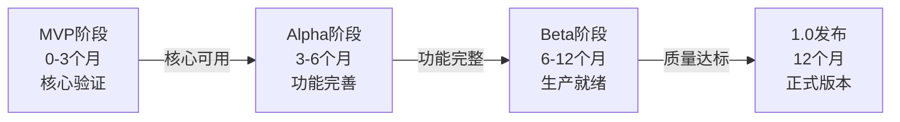
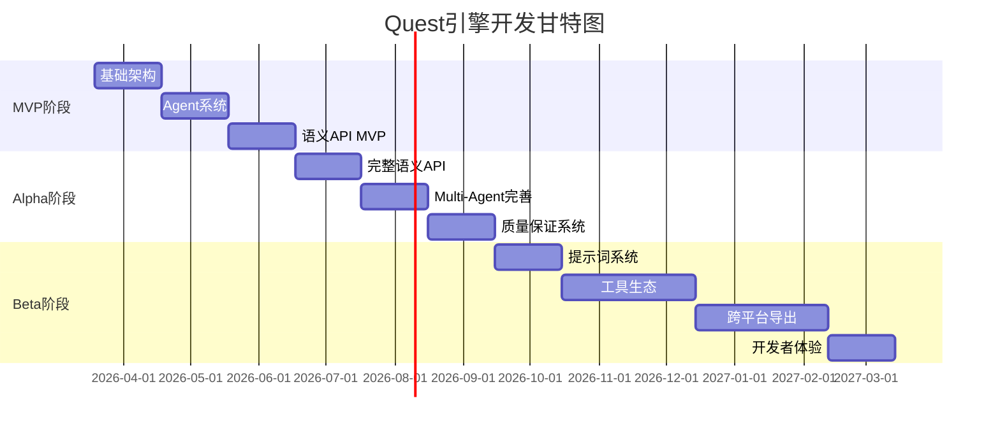

# Quest引擎实施路线图

> **开发周期**: 12个月（MVP到Beta）  
> **开发模式**: 敏捷迭代，持续交付  
> **里程碑**: 4个主要阶段

---

## 目录

- [1. 开发阶段总览](#1-开发阶段总览)
- [2. MVP阶段（0-3个月）](#2-mvp阶段0-3个月)
- [3. Alpha阶段（3-6个月）](#3-alpha阶段3-6个月)
- [4. Beta阶段（6-12个月）](#4-beta阶段6-12个月)
- [5. 资源需求](#5-资源需求)
- [6. 风险管理](#6-风险管理)

---

## 1. 开发阶段总览

### 1.1 四阶段路线图



### 1.2 各阶段目标

| 阶段 | 时间 | 核心目标 | 交付物 | 验收标准 |
|------|------|---------|--------|---------|
| **MVP** | 0-3月 | 验证核心概念 | 可演示原型 | AI能生成简单场景 |
| **Alpha** | 3-6月 | 完善核心功能 | 功能完整版 | 能开发完整小游戏 |
| **Beta** | 6-12月 | 生产级质量 | 稳定可用版 | 性能、文档、工具链完整 |
| **1.0** | 12月 | 正式发布 | 商业可用版 | 公开发布，社区运营 |

---

## 2. MVP阶段（0-3个月）

### 2.1 目标

**核心验证**: 证明"对话驱动游戏开发"的可行性

**成功标准**:
```
用户输入: "创建一个森林场景，有树木、小屋和一个友好的NPC"
Quest输出: 
  → AI生成完整场景
  → Cocos4实时渲染预览
  → 可在浏览器运行
  → 整个过程<60秒
```

### 2.2 里程碑M1: 基础架构（第1个月）

**工作项**:

Week 1-2: 项目搭建
- [ ] 初始化Monorepo（pnpm workspace）
  ```
  quest/
  ├─ packages/
  │  ├─ editor/          # Electron编辑器
  │  ├─ agent-core/      # Agent系统
  │  ├─ semantic-api/    # 语义化API
  │  ├─ cocos4-adapter/  # Cocos4适配器
  │  └─ mcp-servers/     # MCP服务器
  └─ apps/
     └─ runtime/         # 游戏运行时
  ```
- [ ] 配置TypeScript、ESLint、Prettier
- [ ] 搭建Electron编辑器框架（React + Vite）
- [ ] 搭建Node.js后端（Fastify + WebSocket）

Week 3: AI集成
- [ ] 实现OpenRouter客户端
- [ ] 实现基础AI Gateway
- [ ] 测试LLM调用（Claude/GPT）
- [ ] 实现流式响应

Week 4: Cocos 4集成
- [ ] Fork Cocos 4仓库
- [ ] 编译Cocos 4引擎
- [ ] 在编辑器中集成预览窗口
- [ ] 测试基础渲染

**交付物**: 
- 可运行的编辑器框架
- AI对话界面（基础）
- Cocos 4预览窗口

---

### 2.3 里程碑M2: 核心Agent系统（第2个月）

**工作项**:

Week 5-6: Agent基础
- [ ] 实现BaseAgent抽象类
- [ ] 实现MasterAgent（任务分解）
- [ ] 实现SceneAgent（场景生成）
- [ ] Agent间通信机制（黑板系统）

Week 7: Skill系统
- [ ] 实现Skill Markdown解析器
- [ ] 实现SkillRegistry
- [ ] 创建5个核心Skill：
  - [ ] scene-generator（场景生成）
  - [ ] character-designer（角色设计）
  - [ ] terrain-builder（地形构建）
  - [ ] lighting-setup（光照配置）
  - [ ] prop-placer（道具摆放）

Week 8: MCP基础集成
- [ ] 集成@modelcontextprotocol/client
- [ ] 实现MCPHub
- [ ] 创建Cocos 4 MCP服务器
- [ ] 连接3-5个基础MCP工具

**交付物**:
- 可工作的Multi-Agent系统
- 5个核心Skill
- MCP工具集成

---

### 2.4 里程碑M3: 语义化API MVP（第3个月）

**工作项**:

Week 9-10: 语义API设计
- [ ] 定义GameObjectDescriptor类型
- [ ] 定义SceneDescriptor类型
- [ ] 实现SemanticMapper（基础规则）
- [ ] 实现10个核心语义规则

Week 11: Cocos 4适配器
- [ ] 实现createGameObject()
- [ ] 实现createScene()
- [ ] 实现attachBehavior()
- [ ] 运行时独立模式

Week 12: MVP集成测试
- [ ] 端到端测试（对话 → 生成 → 预览）
- [ ] 性能优化
- [ ] Bug修复
- [ ] MVP演示准备

**交付物**: MVP可演示版本

**MVP演示场景**:
```typescript
// 演示脚本
用户: "创建一个森林场景"
  → Quest生成森林（10棵树、草地、天空）
  → 预览窗口实时显示

用户: "添加一个小木屋"
  → Quest添加木屋
  → 实时更新预览

用户: "放一个会巡逻的守卫NPC"
  → Quest生成NPC（外观+行为）
  → NPC开始巡逻

总耗时: <2分钟
传统方式: ~2小时
```

---

## 3. Alpha阶段（3-6个月）

### 3.1 目标

**功能完善**: 支持完整的游戏开发流程

**成功标准**:
```
能够从零开发一个完整的小游戏：
- 3-5个关卡
- 5-10种敌人
- 基础战斗系统
- 简单剧情
- 可导出为可玩的Web游戏
```

### 3.2 里程碑M4: 完整语义API（第4个月）

**工作项**:

Week 13-14: GameObject完整API
- [ ] 实现所有GameObject类型（10+种）
- [ ] 完整的语义规则库（50+规则）
- [ ] 支持复杂行为描述
- [ ] 支持override机制

Week 15-16: Scene高级特性
- [ ] 场景分区（Zone）系统
- [ ] 导航网格生成
- [ ] 动态光照系统
- [ ] 后处理效果

**交付物**: 完整的语义化API v1.0

---

### 3.3 里程碑M5: Multi-Agent完善（第5个月）

**工作项**:

Week 17-18: 专家Agent
- [ ] 实现NPCAgent（角色设计）
- [ ] 实现DialogueAgent（剧情生成）
- [ ] 实现CodeAgent（脚本生成）
- [ ] 实现OptimizationAgent（性能优化）

Week 19-20: Agent协作
- [ ] Agent间消息传递
- [ ] 共享黑板系统
- [ ] Agent工作流可视化
- [ ] 调试工具

**交付物**: 6个专家Agent + 协作机制

---

### 3.4 里程碑M6: 质量保证系统（第6个月）

**工作项**:

Week 21-22: 评估管道
- [ ] 实现EvaluationAgent
- [ ] 性能检查模块
- [ ] 语义验证模块（LLM）
- [ ] 一致性检查

Week 23-24: 自动优化
- [ ] 优化循环（评估→修复→重评估）
- [ ] AI自动调优
- [ ] 质量报告生成
- [ ] Alpha测试

**交付物**: 完整的质量保证系统

**Alpha成果**: 
```
用户: "开发一个简单的塔防游戏"
Quest:
  1. 生成游戏框架（主场景、UI）
  2. 生成敌人（5种，带AI）
  3. 生成防御塔（3种，带攻击逻辑）
  4. 生成波次系统
  5. 自动测试和优化
  → 完整可玩的塔防游戏
  耗时: ~10分钟
```

---

## 4. Beta阶段（6-12个月）

### 4.1 目标

**生产就绪**: 商业项目可用

**成功标准**:
- 性能达标（60 FPS）
- 文档完整（API + 教程）
- 工具链完整（CLI + 插件）
- 稳定性高（Crash率<0.1%）
- 社区初建（100+ Star）

### 4.2 里程碑M7: 提示词系统（第7个月）

**工作项**:

Week 25-26: 提示词管理
- [ ] 提示词版本控制（Git集成）
- [ ] 提示词编辑器UI
- [ ] 提示词对比/Diff工具
- [ ] 提示词回滚功能

Week 27-28: 提示词CI/CD
- [ ] 提示词测试框架
- [ ] 自动化测试运行
- [ ] 提示词质量评分
- [ ] CI/CD集成（GitHub Actions）

**交付物**: 完整的提示词管理系统

---

### 4.3 里程碑M8: 完整工具生态（第8-9个月）

**工作项**:

Week 29-32: Skill生态
- [ ] 开发100个核心Skill
  - 场景生成（20个）
  - 角色设计（20个）
  - 行为AI（20个）
  - 对话系统（15个）
  - 特效（15个）
  - 优化工具（10个）
- [ ] Skill市场UI
- [ ] Skill开发工具
- [ ] Skill文档生成器

Week 33-36: MCP集成
- [ ] 集成ClawHub（3200+ MCP工具）
- [ ] 自定义MCP服务器开发套件
- [ ] MCP工具浏览器（编辑器内）
- [ ] 常用MCP工具预装

**交付物**: 丰富的工具生态

---

### 4.4 里程碑M9: 跨平台导出（第10-11个月）

**工作项**:

Week 37-40: 平台支持
- [ ] Web发布（H5）
  - [ ] 资产压缩和优化
  - [ ] WebGL渲染优化
  - [ ] 加载性能优化
  
- [ ] 移动端导出
  - [ ] iOS构建（Cocos 4原生）
  - [ ] Android构建
  - [ ] 触控适配
  
- [ ] 桌面版
  - [ ] Electron打包
  - [ ] 性能优化
  
Week 41-44: 性能优化
- [ ] 渲染性能优化（60 FPS目标）
- [ ] 资产加载优化
- [ ] 内存优化
- [ ] 包体优化

**交付物**: 跨平台发布能力

---

### 4.5 里程碑M10: 开发者体验（第12个月）

**工作项**:

Week 45-46: 文档
- [ ] 完整API文档（自动生成）
- [ ] 新手教程（10+篇）
- [ ] 视频教程（5+个）
- [ ] 最佳实践指南
- [ ] 故障排查指南

Week 47-48: 开发工具
- [ ] Quest CLI工具
  ```bash
  quest new my-game
  quest dev
  quest build --platform web
  quest deploy
  ```
- [ ] VSCode扩展
- [ ] 调试工具
- [ ] 性能分析器

Week 49-50: 示例项目
- [ ] 5个完整示例游戏
  - 2D平台跳跃
  - 塔防游戏
  - RPG demo
  - 弹幕射击
  - 解谜游戏
  
Week 51-52: Beta发布准备
- [ ] 全面测试
- [ ] Bug修复
- [ ] 性能调优
- [ ] Beta发布

**交付物**: Beta版本发布

---

## 5. 资源需求

### 5.1 人员配置

**MVP阶段（3人）**:
- 1名全栈工程师（编辑器 + 后端）
- 1名游戏引擎工程师（Cocos 4集成）
- 1名AI工程师（Agent系统）

**Alpha阶段（5人）**:
- 2名前端工程师（编辑器功能）
- 2名后端工程师（Agent + Skill）
- 1名游戏引擎工程师

**Beta阶段（8人）**:
- 3名前端工程师
- 3名后端工程师
- 1名游戏引擎工程师
- 1名技术文档工程师

### 5.2 技术资源

**基础设施**:
- ☁️ 云服务器（4核8G）: $50/月
- 🗄️ Redis云服务: $20/月
- 🔍 Pinecone向量数据库: $70/月
- 💾 PostgreSQL: $30/月
- 🌐 CDN: $30/月

**AI成本**:
- 🤖 OpenRouter API: $500-2000/月（开发期）
- 📊 预估: 100万tokens/天 × $0.01/1K = $10/天

**总成本**: 
- MVP阶段: ~$1,000/月
- Alpha阶段: ~$2,500/月
- Beta阶段: ~$5,000/月

---

## 6. 风险管理

### 6.1 技术风险

#### 风险1: Cocos 4 Alpha不稳定 ⭐⭐⭐⭐

**描述**: Cocos 4目前是Alpha版本，API可能变化

**影响**: 可能需要重构适配代码

**缓解策略**:
- 隔离Cocos 4依赖（适配器模式）
- 关注官方更新，及时适配
- 准备Plan B（切换到Babylon.js）

**应急方案**:
```
如果Cocos 4无法使用:
  → 切换到Babylon.js（3D）+ Phaser 3（2D）
  → 预估额外成本: 2个月
```

---

#### 风险2: AI生成质量不稳定 ⭐⭐⭐⭐⭐

**描述**: LLM输出有随机性，质量波动

**影响**: 用户体验不一致

**缓解策略**:
- ✅ 实现评估管道（自动检测质量）
- ✅ 多次生成取最优（N=3）
- ✅ 用户可以"重新生成"
- ✅ 提供"手动微调"能力

**指标**:
```
目标生成质量:
- 首次生成满意度: >85%
- 3次生成后满意度: >95%
```

---

#### 风险3: 性能问题 ⭐⭐⭐

**描述**: AI生成的场景可能性能不佳

**影响**: 游戏运行卡顿

**缓解策略**:
- 评估管道包含性能检查
- OptimizationAgent自动优化
- 用户可设置性能预算

**性能目标**:
```
Web平台: 60 FPS @ 1080p
移动端: 60 FPS @ 720p
多边形预算: <50K per scene
纹理预算: <10MB per scene
```

---

### 6.2 产品风险

#### 风险4: 用户学习成本 ⭐⭐⭐

**描述**: 语义化API是新概念，用户需要学习

**影响**: 初期采用率低

**缓解策略**:
- 提供丰富的示例和模板
- AI助手实时提示（"你可以试试..."）
- 完整的交互式教程
- 社区支持（Discord/论坛）

---

#### 风险5: 竞品追赶 ⭐⭐⭐

**描述**: Unity/Unreal可能快速跟进AI功能

**影响**: 竞争优势减弱

**缓解策略**:
- 快速迭代，保持领先
- 建立开源社区（护城河）
- 专注差异化（语义化API是核心优势）
- 开源部分代码，建立标准

---

### 6.3 商业风险

#### 风险6: AI成本过高 ⭐⭐⭐⭐

**描述**: OpenRouter调用成本可能超预算

**影响**: 商业模式不可持续

**缓解策略**:
- 智能模型路由（简单任务用便宜模型）
- 结果缓存（相似请求复用）
- 本地模型备选（Ollama）
- 用户付费模式（API Key自带）

**成本优化目标**:
```
单个场景生成成本: $0.05 → $0.01
优化手段:
  - 缓存命中率: 60%
  - 模型路由优化: 30%节省
  - Prompt优化: 20% token减少
```

---

## 7. 关键里程碑甘特图



---

## 8. 成功指标

### 8.1 技术指标

| 指标 | MVP目标 | Alpha目标 | Beta目标 |
|------|---------|-----------|---------|
| **AI生成成功率** | 70% | 85% | 95% |
| **生成速度** | <60s | <30s | <10s |
| **渲染性能** | 30 FPS | 45 FPS | 60 FPS |
| **编辑器启动时间** | <10s | <5s | <3s |
| **Skill数量** | 5 | 30 | 100+ |
| **MCP工具数** | 10 | 50 | 500+ |

### 8.2 用户指标

| 指标 | MVP目标 | Alpha目标 | Beta目标 |
|------|---------|-----------|---------|
| **内测用户** | 10 | 50 | 500 |
| **GitHub Stars** | 100 | 500 | 2000 |
| **创建游戏数** | 50 | 500 | 5000 |
| **用户满意度** | 70% | 80% | 90% |
| **文档完整度** | 30% | 70% | 95% |

### 8.3 商业指标

| 指标 | MVP | Alpha | Beta |
|------|-----|-------|------|
| **开发成本** | $15K | $45K | $120K |
| **AI调用成本** | $1.5K | $7.5K | $30K |
| **总投入** | $16.5K | $52.5K | $150K |

---

## 9. 发布计划

### 9.1 版本发布节奏

```
v0.1.0 (MVP)    - 2026年6月   - 内测版
v0.2.0 (Alpha)  - 2026年9月   - 早期访问
v0.5.0 (Beta)   - 2027年3月   - 公开测试
v1.0.0 (Release) - 2027年6月  - 正式发布
```

### 9.2 社区建设计划

**MVP阶段**:
- 创建GitHub组织
- 开源部分代码
- 建立Discord社区

**Alpha阶段**:
- 技术博客（每月1篇）
- 开发者文档
- 示例项目

**Beta阶段**:
- 社区驱动的Skill市场
- 举办线上Workshop
- 建立开发者计划

---

## 10. 下一步行动

### 立即开始（本周）

1. **技术调研**
   - [ ] 深入研究Cocos 4源码
   - [ ] 测试OpenRouter API
   - [ ] 评估MCP TypeScript SDK

2. **原型开发**
   - [ ] 搭建最小可行架构
   - [ ] 实现简单的AI对话
   - [ ] 测试Cocos 4基础渲染

3. **团队组建**
   - [ ] 招募核心开发者
   - [ ] 确定技术栈细节
   - [ ] 制定详细开发计划

### 第一个Sprint（2周）

**Sprint目标**: 完成基础架构搭建

**任务列表**:
- [ ] Day 1-2: Monorepo初始化
- [ ] Day 3-5: Electron编辑器框架
- [ ] Day 6-8: Node.js后端 + WebSocket
- [ ] Day 9-10: OpenRouter集成
- [ ] Day 11-12: Cocos 4预览窗口
- [ ] Day 13-14: 端到端测试

**Demo目标**:
```
实现最简单的对话生成：
用户: "创建一个正方形"
Quest: [调用Cocos 4] → 渲染一个正方形
```

---

**文档版本**: v1.0.0  
**更新日期**: 2026-03-19  
**状态**: 规划阶段
